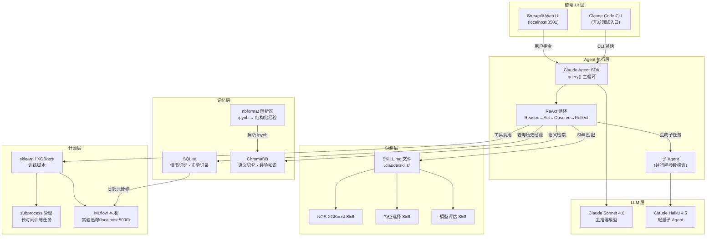

# 实现方案调研报告

> 面向 NGS 领域机器学习分类模型 AI 训练助手
> 调研日期：2026-05-21
> 架构前提：Claude Agent SDK（原 Claude Code SDK）作为 agent 执行运行时，本地部署，Anthropic Claude API 作为 LLM

---

## 模块 1：LLM 接入

### 背景澄清

项目基于 **Claude Agent SDK**（即 Claude Code 底层运行时对外暴露的 Python/TypeScript 库）。这意味着：

- **不需要手写 tool loop**：SDK 已内建 agent 循环（gather context → take action → verify → repeat）
- **调 Claude API 的三种层次**：
  1. **Claude Code CLI 交互层**：人机对话入口，直接使用 claude CLI
  2. **Claude Agent SDK（`claude_agent_sdk.query()`）**：Python 程序内嵌入 agent 循环，这是主要的 LLM 调用方式
  3. **Anthropic Client SDK（`anthropic.messages.create()`）**：绕过 agent 层，直接发起单次 API 请求，用于特殊场景（如批量评估、embedding 生成）

在 Claude Code 环境中调 Claude API 的正确理解：**Claude Code 本身就是 Agent SDK 的 CLI 封装**，在 agent 内"再调 Claude API"的需求有两种正当场景：（a）用 `claude_agent_sdk.query()` 启动子 agent；（b）用 Anthropic Client SDK 做单次无状态请求（如生成 embedding）。两者共存，不冲突。

### 主流方案对比

| 方案 | 适用场景 | 优点 | 缺点 |
|------|---------|------|------|
| **Claude Agent SDK `query()`** | 主循环 / 子 agent | 内建 tool 执行、compaction、session 管理，与 Claude Code 生态无缝集成 | 不支持细粒度 token 控制，依赖 Anthropic 基础设施 |
| **Anthropic Client SDK `messages.create()`** | 单次 API 调用（embedding、评分） | 完全控制 token 预算、模型选择、extended thinking | 需要手写 tool loop；agentic 场景代码量大 |
| **LangChain/LangGraph + Claude** | 复杂工作流编排 | 图形化状态管理、human-in-the-loop | 额外依赖；与 Claude Agent SDK 功能重叠；学习曲线陡 |

### Context Window 管理

Anthropic 提供三层策略（均已内置于 Agent SDK）：

1. **Server-side Compaction**（首选）：自动摘要历史对话，context 趋近上限时触发，对 agent 透明
2. **Context Editing - Tool Result Clearing**（`clear_tool_uses_20250919` beta）：清除旧 tool 调用结果，保留推理链；适合大量 Bash/Read 工具调用的 ML 训练场景
3. **Context Editing - Thinking Block Clearing**（`clear_thinking_20251015` beta）：管理 extended thinking blocks，Sonnet 4.6+ 默认保留全部 thinking

**Token 预算控制**：
- Agent SDK 的 `ClaudeAgentOptions` 支持指定 `allowed_tools`、`permission_mode`；通过 hooks（`PreToolUse`/`PostToolUse`）可监控每轮 token 消耗
- 使用 Haiku 4.5 作为轻量子 agent（成本是 Sonnet 的 1/3），Sonnet 4.6 作为主推理模型
- Extended thinking 默认预留 31,999 token；生产环境建议通过 `MAX_THINKING_TOKENS` 环境变量限制

### 推荐方案

**选择**：Claude Agent SDK（`claude_agent_sdk.query()`）作为主循环；Anthropic Client SDK 仅用于 embedding 生成和批量评估

**理由**：
- Agent SDK 与 Claude Code CLI 共享同一套 tool 执行、session、compaction 基础设施，维护成本最低
- 无需手写 agent loop；Skills、subagents、hooks 均开箱即用
- Context compaction 自动处理长训练实验中的 context 膨胀

**为什么不用 LangChain/LangGraph**：引入额外抽象层，与 Agent SDK 功能高度重叠；在纯 Claude 场景下是不必要的复杂度

**为什么不全用 Client SDK**：手写 ReAct 循环代码量大且容易出错，而 Agent SDK 已经实现并验证了这套循环

**工作量预估**：2-3 人天（1 名熟悉 Anthropic SDK 的 Python 开发者）

---

## 模块 2：Harness 架构（Agent 执行框架）

### 核心架构决策：三个选项

| 选项 | 描述 | 适用层 |
|------|------|--------|
| **A. Claude Code CLI + SKILL.md + Slash Commands** | 纯 CLI 交互，skills 驱动，用户在终端直接对话 | 开发调试、日常使用 |
| **B. Claude Agent SDK（Python 嵌入）** | `claude_agent_sdk.query()` 内嵌于 Python 主程序，前端通过 API 驱动 | 生产自动化循环、UI 集成 |
| **C. 纯 Anthropic Client SDK + 手写 tool loop** | 完全自定义的 ReAct 循环 | 特殊研究场景 |

**推荐**：**A + B 混合**——CLI 作为开发/调试入口，Python 主程序用 Agent SDK 驱动自主训练循环，两者共享同一套 .claude/ 配置和 Skills 文件。

### ReAct 循环实现

Claude Agent SDK 内建 ReAct 循环，无需外部框架：

```python
async for message in query(
    prompt="探索 NGS 甲基化特征组合，当前最优 AUC=0.82，尝试新的特征选择策略",
    options=ClaudeAgentOptions(
        allowed_tools=["Read", "Write", "Bash", "Agent"],
        agents={"evaluator": AgentDefinition(...)},
        skills="all",
        permission_mode="acceptEdits",
    ),
):
    handle_message(message)
```

循环结构：
1. **Reason**：Claude 分析当前实验结果，决定下一步特征组合
2. **Act**：调用 `Bash` 工具运行 sklearn/XGBoost 训练脚本
3. **Observe**：读取训练输出（accuracy、AUC、feature importance）
4. **Reflect**：更新实验记忆，决定是否继续探索

### Plan-and-Execute 模式

对于长期训练任务（多轮特征探索），可使用 session 持久化：

```python
# 第一轮：制定实验计划
session_id = await start_planning_session(data_path, target_metric)

# 后续轮次：在同一 session 中继续
async for message in query(
    prompt="基于上轮结果，继续探索",
    options=ClaudeAgentOptions(resume=session_id),
):
    ...
```

### 工具配置（给 Agent 配哪些 tool）

| 工具 | 用途 | 配置方式 |
|------|------|---------|
| `Bash` | 运行 Python 训练脚本、sklearn/XGBoost 调用 | Agent SDK 内建 |
| `Read` / `Write` / `Edit` | 读写数据集、结果文件、配置 | Agent SDK 内建 |
| `Glob` / `Grep` | 搜索实验记录、特征文件 | Agent SDK 内建 |
| `Agent`（子 agent） | 并行运行多组超参数实验 | `allowed_tools=["Agent"]` |
| MLflow MCP server | 记录实验指标（自定义 MCP） | `.claude/mcp.json` 配置 |
| Memory MCP server | RAG 查询历史经验 | `.claude/mcp.json` 配置 |

### 能力边界约束

```python
options = ClaudeAgentOptions(
    allowed_tools=["Read", "Bash", "Write", "Glob", "Grep", "Agent"],
    permission_mode="acceptEdits",  # 自动接受文件编辑
    # 禁止删除数据目录、禁止网络请求（通过 hooks 实现）
    hooks={
        "PreToolUse": [
            HookMatcher(matcher="Bash", hooks=[validate_bash_safety])
        ]
    }
)
```

### 主流框架对比

| 框架 | 优势 | 劣势 | ML 训练适用性 |
|------|------|------|--------------|
| **Claude Agent SDK** | 与 Claude Code 完全集成、Skills/subagents/hooks 内建、compaction 自动 | 仅支持 Claude | 最适合（本项目架构前提） |
| **LangGraph** | 图形化状态机、强健的错误恢复、最佳 production 控制 | 学习曲线陡、与 Agent SDK 功能重叠 | 适合（但引入额外依赖） |
| **CrewAI** | 角色式 agent 定义、上手快 | 灵活性低、状态控制弱 | 一般（不适合迭代探索） |
| **AutoGen** | 多 agent 对话 | token 消耗大（每轮全量历史）、非确定性 | 不适合（成本和可控性问题） |

### 推荐方案

**选择**：Claude Agent SDK（Python 嵌入）+ Claude Code CLI（开发入口）

**为什么不用 LangGraph**：本项目已有 Agent SDK 作为运行时，LangGraph 的状态管理优势在 Agent SDK 的 session 机制下已满足；引入 LangGraph 是额外依赖而非额外价值

**为什么不用 AutoGen**：GroupChat 模式的 token 消耗对高频 ML 实验不经济；可控性弱，难以约束危险操作

**工作量预估**：5-8 人天（含工具配置、safety hooks、子 agent 设计）

---

## 模块 3：记忆层

### 记忆类型分析

| 记忆类型 | 内容 | 时效 | 实现 |
|---------|------|------|------|
| **工作记忆（Working）** | 当前 session 对话历史、当前实验状态 | Session 级 | Agent SDK context window + compaction |
| **情节记忆（Episodic）** | 历史实验记录（特征组合、超参数、指标）、时间戳 | 永久 | SQLite 结构化存储 |
| **语义记忆（Semantic）** | 经验总结、文献知识、领域规律（如"甲基化特征 X 在 CNS 肿瘤分类中有效"）| 永久 | ChromaDB 向量索引 |

### 存储方案对比

| 方案 | 优点 | 缺点 | 适用场景 |
|------|------|------|---------|
| **SQLite（情节）** | 零配置、精确查询、Python 原生 | 无语义搜索 | 实验记录、指标历史 |
| **ChromaDB（语义）** | 最易上手、本地部署、Python 原生 | 不支持实时更新（需重建索引）、生产稳定性一般 | 原型和中小规模 |
| **Qdrant（语义）** | Rust 编写性能好、生产级特性、丰富过滤 | 配置略复杂 | 需进一步验证（记忆库规模大时升级） |
| **FAISS（语义）** | 最快速度、GPU 加速 | 无持久化、无实时更新 | 不适合（记忆需要增量更新） |
| **纯 JSON 文件** | 最简单 | 无语义搜索、规模受限 | 仅适合 POC |

**推荐存储架构**：SQLite + ChromaDB 混合

```
memory/
├── experiments.db          # SQLite：情节记忆（实验记录）
│   ├── experiments         # 特征组合、模型参数、AUC、时间戳
│   ├── features            # 特征元数据
│   └── results             # 详细指标
├── chroma/                 # ChromaDB：语义记忆（经验向量索引）
│   ├── knowledge           # 经验总结、文献摘录
│   └── notebooks           # ipynb 提炼的结构化经验
└── raw/                    # 原始 ipynb 和文献文件
```

### RAG 检索机制

训练前检索流程：
1. **精确查询**：SQLite 查询当前特征集的历史实验结果（IF EXISTS）
2. **语义检索**：ChromaDB 检索相似特征场景的经验（embedding similarity）
3. **上下文注入**：将检索到的经验注入 agent system prompt 或初始对话

```python
# MCP server 封装记忆查询
@tool
def query_memory(feature_set: list[str], query: str, top_k: int = 5) -> str:
    """查询历史实验经验和相关文献"""
    # 1. SQLite 精确查询
    exact_results = db.query_experiments(feature_set)
    # 2. ChromaDB 语义搜索
    semantic_results = chroma.query(query_texts=[query], n_results=top_k)
    return format_context(exact_results, semantic_results)
```

### ipynb 自动解析为经验

使用 `nbformat` 库解析 Jupyter Notebook，提炼结构化记忆：

```python
import nbformat

def extract_experiment_from_notebook(ipynb_path: str) -> dict:
    """解析 ipynb 为结构化实验记录"""
    nb = nbformat.read(ipynb_path, as_version=4)
    experience = {
        "features": [],        # 从代码单元提取特征列表
        "model_params": {},    # 从代码提取模型参数
        "metrics": {},         # 从输出单元提取 AUC/accuracy
        "conclusions": [],     # 从 Markdown 单元提取结论
        "code_snippets": [],   # 关键代码片段
    }
    for cell in nb.cells:
        if cell.cell_type == "code":
            parse_code_cell(cell, experience)
        elif cell.cell_type == "markdown":
            parse_markdown_cell(cell, experience)
    return experience
```

实际的 `parse_code_cell` 中用 AST 解析或 regex 提取特征名、模型参数、指标数值——具体格式需要根据项目 notebook 规范定义（**需进一步验证**：需分析实际 notebook 风格后设计提取规则）。

### 经验更新机制（防止记忆污染）

1. **只追加，不覆盖**：实验记录不可变，结论以新记录追加（带时间戳和版本）
2. **置信度标签**：来自 ipynb 导入的经验标记为 `source=notebook`，来自文献的标记为 `source=paper`，agent 自主总结的标记为 `source=agent`
3. **冲突检测**：新经验与旧经验结论矛盾时，标记为 `needs_review` 而非自动覆盖
4. **定期蒸馏**：用 slash command `/compact-memory` 触发 LLM 对旧经验做摘要压缩

### 推荐方案

**选择**：SQLite（情节记忆）+ ChromaDB（语义记忆）+ nbformat 解析管道

**为什么不选 Qdrant**：初期记忆库规模小（数百条），ChromaDB 足够；Qdrant 作为规模化后的升级路径

**为什么不选纯 JSON**：缺乏语义搜索能力，无法支持"找与当前任务相似的历史经验"

**工作量预估**：8-12 人天（含 SQLite schema 设计、ChromaDB 集成、nbformat 解析器、MCP server 封装）

---

## 模块 4：前端 UI

### 交互形态分析

| 选项 | 优点 | 缺点 | 适合本项目？ |
|------|------|------|------------|
| **a. Streamlit** | Python 原生、快速开发、仪表板能力强、本地部署无需配置 | 不适合长连接实时更新（需 st.empty + 轮询）、样式定制有限 | 最适合 |
| **b. Gradio** | ML demo 场景优化、HuggingFace 生态、流式输出支持好 | 仪表板和复杂数据展示能力弱于 Streamlit | 适合（但侧重 demo，不适合监控仪表板）|
| **c. Claude Code CLI 直接命令行** | 零额外开发、最简方式 | 无可视化、无持久化展示、非技术用户难用 | 适合开发调试阶段 |
| **d. Next.js（Web App）** | 最灵活、最好看 | 需要前后端分离、Python 桥接复杂、本地部署重 | 过度工程 |
| **e. Electron/Tauri（桌面 App）** | 原生桌面体验 | 开发成本最高 | 过度工程 |

### 功能需求映射

| 功能 | Streamlit 实现方式 |
|------|-------------------|
| **任务监控面板** | `st.progress` + `st.status` + 轮询后端状态文件 |
| **实验记录展示** | `st.dataframe` 展示 SQLite 查询结果，`st.line_chart` 绘制 AUC 曲线 |
| **记忆库浏览** | `st.expander` 展示 ChromaDB 检索结果，支持关键词搜索 |
| **ipynb 导入** | `st.file_uploader` + nbformat 解析管道 |
| **交互式训练指令** | `st.chat_input` + 调用 `claude_agent_sdk.query()` |
| **实时训练日志** | `st.empty` + 1s 轮询日志文件，或使用 `st.write_stream` |

### 推荐方案

**选择**：Streamlit（主 UI）+ Claude Code CLI（开发调试入口）

**理由**：
- 本地部署 `streamlit run app.py` 即可，零额外依赖
- Python 全栈，与 Agent SDK、SQLite、ChromaDB 直接集成
- Streamlit 的仪表板能力（dataframe、charts、file_uploader）覆盖所有功能需求
- 技术用户可继续使用 CLI，非技术用户通过 Streamlit UI 操作

**为什么不用 Gradio**：Gradio 优化 ML demo（输入→输出），不适合多面板仪表板（实验记录、记忆库浏览同时展示）

**为什么不用 Next.js**：本地单用户场景不需要前后端分离，Python 桥接（REST API 或 WebSocket）引入不必要复杂度

**工作量预估**：5-8 人天（含 Streamlit 应用、后端状态 API、Claude Agent SDK 集成）

---

## 模块 5：Skill 层

### Skill 是什么

在 Claude Agent SDK 中，**Skill** 是存储于文件系统的 `SKILL.md` 文件，包含 YAML frontmatter + Markdown 指令。Claude 根据 `description` 字段自主决定何时调用某个 Skill。

对于本项目，**ML 训练 Skill = 一套完整的特征选择 + 模型 + 超参数流程的固化范式**。

### Skill 文件格式

```
.claude/skills/ngs-classification-xgboost/
└── SKILL.md
```

```markdown
---
name: ngs-classification-xgboost
description: >
  用于 NGS 数据的 XGBoost 分类训练范式。
  当用户需要在 NGS/基因组数据上训练 XGBoost 分类模型、
  选择甲基化特征、评估分类性能时使用此 skill。
version: 1.0.0
author: MLagent
---

# NGS XGBoost 分类训练范式

## 适用场景
- 输入：NGS 样本 × 特征矩阵（csv），样本标签（cancer_type）
- 目标：最大化 macro AUC

## 标准流程

### 1. 特征预处理
- 过滤低方差特征（threshold=0.01）
- 处理缺失值（median imputation）

### 2. 特征选择
- 候选策略：SelectKBest(ANOVA)、递归特征消除(RFE)、XGBoost feature importance
- 默认：先用 SelectKBest(k=500) 粗筛，再用 RFE 精筛到 50-200 个

### 3. 模型训练
```python
from xgboost import XGBClassifier
from sklearn.model_selection import StratifiedKFold, cross_val_score

model = XGBClassifier(
    n_estimators=200,
    max_depth=6,
    learning_rate=0.1,
    subsample=0.8,
    colsample_bytree=0.8,
    eval_metric="auc",
    use_label_encoder=False,
)
cv_scores = cross_val_score(model, X, y, cv=StratifiedKFold(5), scoring="roc_auc_ovr")
```

### 4. 评估指标
- macro AUC（主要）
- per-class AUC、accuracy、F1（次要）
- 混淆矩阵

### 5. 结果记录
- 调用 `record_experiment(features, params, metrics)` 写入 SQLite
```
```

### Skill 自动生成

从探索过程提炼 Skill 的流程：

1. **触发条件**：某个实验组合达到目标指标阈值（如 AUC > 0.90）
2. **提炼过程**：Agent 用 LLM 将当前 session 的推理链和代码提炼为 Skill 草稿
3. **人工确认**：通过 Streamlit UI 展示草稿，用户确认后写入 `.claude/skills/`
4. **版本标记**：Skill YAML frontmatter 中记录版本、来源实验 ID、性能基线

具体"从实验记录自动生成 SKILL.md"的 prompt 模板和质量控制逻辑 **需进一步验证**（依赖实际 notebook 和实验记录的格式）。

### Skill 调用机制

```python
options = ClaudeAgentOptions(
    setting_sources=["user", "project"],
    skills="all",           # 启用所有已发现的 skills
    allowed_tools=["Read", "Write", "Bash", "Glob"],
)

async for message in query(
    prompt="在 CNS_data.csv 上训练一个甲基化分类模型，要求 AUC > 0.88",
    options=options,
):
    ...
# Claude 自动匹配 description，调用 ngs-classification-xgboost skill
```

选择机制：Claude 将用户 prompt 与所有 Skill 的 `description` 字段做语义匹配，自主选择最相关的 Skill；多 Skill 可组合调用（如先用"特征筛选 skill"再用"XGBoost 训练 skill"）。

### Skill 版本管理

- **文件系统版本**：每个 Skill 目录用 git 跟踪，`SKILL.md` frontmatter 中记录 `version` 字段
- **性能基线绑定**：`baseline_auc: 0.88` 记录在 frontmatter，回归时可对比
- **弃用机制**：旧 Skill 重命名加 `-deprecated` 后缀而非删除（保持实验可复现性）

### ipynb → Skill 转化

转化流程：
1. 用户在 UI 上传 `.ipynb` 文件
2. nbformat 解析提取关键代码、参数、结论
3. LLM 将提取内容结构化为 SKILL.md 草稿（description、流程步骤、代码模板）
4. 用户在 UI 审核、编辑、确认
5. 写入 `.claude/skills/<skill-name>/SKILL.md`

### 推荐方案

**选择**：原生 Claude Agent SDK Skill 系统（`.claude/skills/*/SKILL.md`）

**理由**：Anthropic 官方设计，与 SDK 深度集成，Claude 自主选择无需额外路由逻辑；git 管理天然支持版本控制

**为什么不用自定义 Skill 格式**：重复造轮子；自定义格式需要手写 Skill 路由和选择逻辑，而 Agent SDK 已原生支持

**工作量预估**：6-10 人天（含 Skill 设计规范制定、初始 Skill 编写、ipynb→Skill 转化管道）

---

## 模块 6：部署运维

### 本地部署架构

```
用户机器
├── Python 环境（uv 管理）
│   ├── claude-agent-sdk
│   ├── anthropic
│   ├── scikit-learn / xgboost
│   ├── chromadb
│   ├── streamlit
│   ├── nbformat
│   └── mlflow
├── 运行时
│   ├── Streamlit UI（端口 8501）
│   ├── MLflow UI（端口 5000）
│   └── Agent 进程（后台 subprocess）
└── 数据层
    ├── memory/experiments.db（SQLite）
    ├── memory/chroma/（ChromaDB）
    └── experiments/（训练数据、结果文件）
```

### 依赖管理方案对比

| 工具 | 速度 | ML 库支持 | GPU/CUDA | 适用场景 |
|------|------|----------|---------|---------|
| **uv** | 最快（10-100× pip）| PyPI 全覆盖 | 仅 PyPI 包 | 纯 PyPI 依赖（推荐） |
| **conda/mamba** | 慢（环境创建 2+ 分钟）| 含 conda-forge | 最佳（CUDA toolkit）| 需要 GPU 或非 PyPI 二进制包 |
| **poetry** | 中等 | PyPI | 仅 PyPI | 库发布、长期维护项目 |
| **pip** | 基准速度 | PyPI | 仅 PyPI | 不推荐（无锁文件） |

**本项目推荐**：**uv**（sklearn、XGBoost、ChromaDB 均在 PyPI）

若未来引入 GPU 加速（如 XGBoost GPU 版本），使用 conda 创建基础环境，再用 uv/pip 安装剩余依赖。

### 硬件配置

| 组件 | 最低配置 | 推荐配置 | 说明 |
|------|---------|---------|------|
| RAM | 8 GB | 16-32 GB | ChromaDB 向量索引 + 大型 NGS 特征矩阵（数万特征）同时在内存 |
| CPU | 4 核 | 8-16 核 | sklearn 多线程训练；XGBoost `n_jobs=-1` |
| GPU | 不需要 | 可选（RTX 3060+） | sklearn/XGBoost 在 CPU 上已足够；GPU 仅在深度学习扩展时需要 |
| 磁盘 | 20 GB | 100 GB+ | NGS 原始数据（10x 数据集可达数十 GB） |

**当前阶段（sklearn/XGBoost 分类）：CPU-only，16 GB RAM 足够**，无需 GPU。

### 长时间训练任务管理

**方案对比**：

| 方案 | 复杂度 | 适合场景 |
|------|--------|---------|
| **Python subprocess + 状态文件** | 最简单 | 单机单任务（推荐初期） |
| **RQ（Redis Queue）** | 中等（需 Redis）| 多任务队列（12,500 tasks/s，比 Celery 省 30% 内存） |
| **Celery + Redis/RabbitMQ** | 较复杂 | 分布式生产场景（过度工程） |
| **supervisord** | 简单（纯配置）| 守护进程管理、自动重启 |

**推荐初期方案**：`subprocess.Popen` + 状态文件 + Streamlit 轮询

```python
# 启动训练任务
proc = subprocess.Popen(
    ["python", "train.py", "--config", config_path],
    stdout=open(log_file, "w"),
    stderr=subprocess.STDOUT,
)
# 将 PID 和状态写入 SQLite
db.record_job(pid=proc.pid, status="running", log_file=log_file)
```

若任务量增长到需要队列管理：升级为 **RQ + Redis**（相比 Celery 更轻量，无需 RabbitMQ）。

### 日志与监控

**MLflow 本地部署**（强烈推荐）：

```bash
mlflow ui --port 5000  # 访问 http://localhost:5000
```

集成方式：
```python
import mlflow
mlflow.sklearn.autolog()    # 自动记录 sklearn 参数和指标
mlflow.xgboost.autolog()    # 自动记录 XGBoost 参数和指标

with mlflow.start_run():
    model.fit(X_train, y_train)
    # 自动捕获：n_estimators、learning_rate、AUC、feature_importance
```

**不推荐 Weights & Biases（W&B）Local**：需要 Docker，本地配置复杂；MLflow 本地版零配置即可使用。

### 甲基化特征自优化二次开发接口（预留）

为甲基化特征自优化能力预留以下扩展点（**需进一步验证**：具体接口设计需等待业务需求明确）：

- **特征评分接口**：`methylation_feature_scorer(feature_matrix, labels) -> importance_scores`
- **特征空间定义接口**：允许外部注入 CpG 位点先验知识（如基因组坐标、已知调控区域）
- **自定义约束接口**：支持注入特征筛选约束（如"仅选 TSS 周围 2kb 的 CpG 位点"）

### 推荐方案

**选择**：uv（依赖管理）+ subprocess（任务管理）+ MLflow（本地监控）+ supervisord（进程守护，可选）

**为什么不用 Celery**：本地单用户场景无需分布式 worker；Celery + RabbitMQ 配置复杂度远超价值

**为什么不用 W&B Local**：需要 Docker，MLflow 零配置本地使用更简单

**工作量预估**：3-5 人天（含环境配置脚本、MLflow 集成、任务管理、日志系统）

---

## 架构总图（Mermaid）



---

## 推荐技术栈汇总表

| 模块 | 推荐方案 | 备选 | 工作量（人天）|
|------|---------|------|-------------|
| **M1 LLM 接入** | Claude Agent SDK (`query()`) + Anthropic Client SDK（embedding） | 无需备选 | 2-3 |
| **M2 Harness 架构** | Claude Agent SDK + Claude Code CLI（混合） | LangGraph（需进一步验证） | 5-8 |
| **M3 记忆层** | SQLite（情节）+ ChromaDB（语义）+ nbformat | Qdrant（规模化升级路径） | 8-12 |
| **M4 前端 UI** | Streamlit + Claude Code CLI（开发入口） | Gradio（demo 场景） | 5-8 |
| **M5 Skill 层** | 原生 Agent SDK Skills（SKILL.md）| 自定义 skill 路由（不推荐） | 6-10 |
| **M6 部署运维** | uv + subprocess + MLflow 本地 + supervisord | RQ+Redis（任务量增长后） | 3-5 |
| **总计** | | | **29-46 人天** |

> 估算假设：1 名高级 Python 工程师，熟悉 Anthropic SDK 和 sklearn/XGBoost，不熟悉 MLflow 和 ChromaDB。

---

## 核心结论（给决策汇总用）

### 1. 架构选择是对的

基于 Claude Agent SDK 的本地部署方案技术上完全可行：SDK 已经内建了 ReAct 循环、session 管理、context compaction、Skills 系统，无需引入 LangChain/AutoGen 等额外框架。

### 2. 关键技术决策

| 决策点 | 选择 | 核心理由 |
|--------|------|---------|
| LLM 框架 | Agent SDK（不用 LangChain） | Agent SDK 功能超集，减少依赖 |
| 记忆存储 | SQLite + ChromaDB | 精确查询（情节）+ 语义搜索（知识），互补 |
| UI | Streamlit | Python 原生，零配置本地部署，仪表板能力强 |
| Skill 格式 | 官方 SKILL.md | 与 SDK 原生集成，无需自己实现路由 |
| 依赖管理 | uv | 速度快（100x pip），PyPI 支持完整 |
| 实验追踪 | MLflow 本地 | 零配置，sklearn/XGBoost autolog |

### 3. 风险与不确定性

| 风险 | 严重度 | 缓解措施 |
|------|-------|---------|
| ipynb→Skill 自动化质量参差 | 中 | 人工确认步骤，不全自动化 |
| Context window 在长实验中快速膨胀 | 中 | 启用 server-side compaction + tool result clearing |
| ChromaDB 记忆污染（bad experience 被检索） | 低-中 | 置信度标签 + 人工审核机制 |
| NGS 甲基化特征自优化接口设计 | 需进一步验证 | 预留扩展点，先实现通用接口 |

### 4. 推荐开发顺序

1. **Phase 1（MVP，2 周）**：Agent SDK 主循环 + Bash 工具调用 sklearn/XGBoost + SQLite 实验记录 + CLI 交互
2. **Phase 2（+2 周）**：ChromaDB 语义记忆 + 第一批 SKILL.md + Streamlit 基础 UI
3. **Phase 3（+2 周）**：ipynb 解析导入 + MLflow 集成 + 子 agent 并行探索
4. **Phase 4（+1 周）**：甲基化特征自优化接口预留 + 生产硬化（supervisord、错误恢复）

**总工期估算：7-8 周（1 名全职工程师）**

---

## 参考资料

### 主要来源（WebFetch / 官方文档）

1. [Claude Agent SDK Overview](https://code.claude.com/docs/en/agent-sdk/overview) — Anthropic 官方 SDK 文档
2. [Building Agents with the Claude Agent SDK](https://www.anthropic.com/engineering/building-agents-with-the-claude-agent-sdk) — Anthropic 工程博客（2025-09-29）
3. [Agent Skills in the SDK](https://code.claude.com/docs/en/agent-sdk/skills) — Skill 文件格式与调用机制
4. [Context Editing - Claude API Docs](https://platform.claude.com/docs/en/build-with-claude/context-editing) — context window 管理策略

### WebSearch 来源

5. [CrewAI vs LangGraph vs AutoGen](https://openagents.org/blog/posts/2026-02-23-open-source-ai-agent-frameworks-compared) — OpenAgents Blog（2026）
6. [LangGraph vs AutoGen: Comparing Multi-Agent AI Frameworks](https://www.truefoundry.com/blog/autogen-vs-langgraph) — TrueFoundry
7. [Vector Stores for RAG Comparison](https://localaimaster.com/blog/vector-databases-comparison) — Local AI Master
8. [Streamlit vs Gradio in 2025](https://www.squadbase.dev/en/blog/streamlit-vs-gradio-in-2025-a-framework-comparison-for-ai-apps) — Squadbase
9. [MLflow XGBoost Integration](https://mlflow.org/docs/latest/ml/traditional-ml/xgboost/) — MLflow 官方文档
10. [uv vs conda vs poetry 2026](https://scopir.com/posts/best-python-package-managers-2026/) — Scopir
11. [Python Background Tasks 2025: Celery, RQ, or Dramatiq?](https://devproportal.com/languages/python/python-background-tasks-celery-rq-dramatiq-comparison-2025/) — DevPro Portal
12. [AI Agent Memory Systems: RAG vs Local SQLite vs Vector DB](https://openclaw-ai.net/en/blog/ai-agent-memory-systems-2026) — OpenClaw（2026）
13. [NGS Methylation ML Classification](https://pmc.ncbi.nlm.nih.gov/articles/PMC11588780/) — PMC（2024）
14. [alirezarezvani/claude-skills](https://github.com/alirezarezvani/claude-skills) — GitHub（Skill 库实例参考）
15. [Agent Skills Library - mcpservers.org](https://mcpservers.org/agent-skills) — Skill 生态参考
