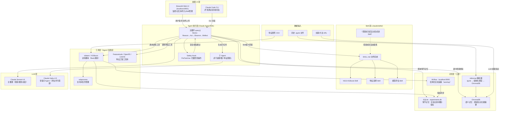

# 决策汇总：NGS ML 训练 AI 助手 · 立项决策

> 综合来源：01-产品形态.md / 02-开源项目.md / 03-实现方案.md / 06-架构基线决策.md（v2 更新来源）
> 综合日期：2026-05-21
> **v2 更新日期：2026-05-22**
> **v2 更新原因：经源码对抗调研（8 份 position paper + 红队 24 条质疑 + 13 组组合评估辩论）验证后调整**
> 状态：立项决策版本 v2，经对抗调研验证

---

## 一、产品形态决策

### 1.1 市场空白确认（可建立产品的依据）

调研覆盖 14 个同类系统（AIDE、RD-Agent、MALMAS、CellAtria 等），交叉验证后确认：

**目前没有任何产品同时满足以下 5 个条件：**

| 条件 | 现有最近产品 | 差距 |
|------|------------|------|
| 面向 NGS/生物信息 ML 训练 | CellAtria（scRNA-seq 流程分析）| CellAtria 不做训练优化，只做标准流程 |
| 跨会话持久化经验库 | MALMAS（三层记忆，研究论文）| 无产品化，无持久化存储 |
| ipynb + 文献导入 | RD-Agent（文献导入，量化金融场景）| 无 ipynb 导入，无 NGS 场景 |
| Skill 复用机制 | 无 | 均为一次性执行，无范式沉淀 |
| 对话式交互实时迭代 | AgentHPO、CellAtria（部分）| 无 NGS ML 训练专项 |

**结论：差异化空间明确，市场窗口真实存在。**

---

### 1.2 产品形态：长什么样

#### 整体形态

```
用户入口：双模并行
  ├── Streamlit Web UI（主界面，localhost:8501）—— 监控、记忆库、导入、可视化
  └── Claude Code CLI（开发调试入口）—— 直接发指令、开发 skill
```

#### 首页结构（Streamlit）

```
┌────────────────────────────────────────────────────────────┐
│  顶部导航：[新任务] [实验历史] [经验记忆库] [Skill 管理] [设置]  │
├─────────────────────┬──────────────────────────────────────┤
│  左侧：当前任务面板   │  右侧：实时日志 + 实验进度               │
│  ──────────────     │  ─────────────────────────────────    │
│  · 数据集路径        │  [Agent 正在探索特征组合 #12/50...]     │
│  · 目标指标 (AUC)    │  [当前最优: AUC=0.884, 15个特征]        │
│  · 模式选择          │  [尝试: +甲基化密度特征, AUC=0.891 ↑]   │
│    ○ 探索模式        │  ─────────────────────────────────    │
│    ○ Skill 范式      │  最近实验列表 (来自 SQLite)             │
│    ○ 交互模式        │  AUC 曲线图 (st.line_chart)            │
├─────────────────────┴──────────────────────────────────────┤
│  底部：用户指令输入框（交互模式下激活）                          │
│  "继续探索 / 切换到 LightGBM / 重点优化召回率..."               │
└────────────────────────────────────────────────────────────┘
```

#### 4 个功能模块的具体形态

| 功能模块 | 用户操作 | Agent 行为 | 输出 |
|---------|---------|-----------|------|
| **探索模式** | 上传特征矩阵、设定目标AUC、设定最大轮数 | 树搜索（参考AIDE）自主探索特征组合 → 更新经验库 → 总结最优范式 | 最优特征子集 + 模型参数 + Skill草稿 |
| **记忆经验库** | 上传ipynb / 导入文献链接 / 查看自动积累 | nbformat解析ipynb → 提炼为结构化经验 → 写入ChromaDB | 可语义检索的知识库 |
| **Skill 范式训练** | 从库中选择Skill → 更新数据或目标 | 载入SKILL.md → 执行固定流程 → 记录结果 | 可复现的训练结果 |
| **交互式训练** | 发指令 → 等结果 → 继续发指令 | 参考记忆库首次训练 → 实时记录 → 按用户指令优化 | 每次迭代完反馈，等待下一条指令 |

---

## 二、开源复用决策

### 2.1 Fork / 集成清单

| 项目 | 决策 | License | Stars | 用途 |
|------|------|---------|-------|------|
| **AIDE** (WecoAI/aideml) | **Fork + 重构** | MIT | 1.3K | 探索模式核心引擎：树搜索 + 代码生成 + 指标评估循环 |
| **mem0** (mem0ai/mem0) | **pip install** | Apache-2.0 | 56K | 语义记忆层，多级记忆 API |
| **MLflow** (mlflow/mlflow) | **pip install** | Apache-2.0 | 26K | 结构化实验追踪（参数/指标/模型） |
| **Featuretools** (alteryx) | **pip install（可选）** | BSD-3 | 7.6K | 关系型数据特征合成工具，定位"Agent 可选工具箱"，NGS 单矩阵场景价值有限 |
| **OpenFE** (IIIS-Li-Group) | **pip install（可选）** | MIT | 870 | 批量特征生成工具，需 Agent 层增加内存限制和 OOM fallback（Issue #62/#53） |
| **CAAFE** (noahho) | **仅参考（不复用代码）** | Apache-2.0 | 192 | openai==0.28 与 AIDE/mem0 的 openai>=1.69 硬冲突，降级为纯设计参考 |
| **jupyter-ai** (jupyterlab) | **仅参考（不复用代码）** | BSD-3 | 4.2K | v3.0 重构不稳定，仅学习 MCP server 设计模式 |
| **notebook-intelligence** | **仅参考（不复用代码）** | GPL-3.0 | 301 | GPL-3.0 convey 风险 + PR #290/#323 路径遍历漏洞，降级为纯设计参考 |
| **OpenHands** | **仅参考** | MIT | 74K | 沙盒执行环境设计、评估基础设施参考 |
| **SWE-agent** | **仅参考** | MIT | 19K | ACI（agent-computer interface）设计模式参考 |

**明确排除：**
- **AutoML-Agent**：CC BY-NC 4.0 禁商用，硬性排除
- **Letta / OpenHands**：与 Claude Code harness 架构冲突，不引入为 runtime
- **MetaGPT**：Python 3.9-3.11 版本限制，且 ML 训练是边缘功能

### 2.2 生态拼图

```
探索引擎    → AIDE (fork)
记忆系统    → mem0 (semantic) + MLflow (structured) + SQLite (episodic)
特征工具    → Featuretools + OpenFE（可选 agent 工具）+ CAAFE（仅设计参考）
Skill 层    → Claude Code 内置 Skills 系统（.claude/skills/）
Harness     → Claude Code CLI + Agent SDK（已定，无需引入第三方）
ipynb 接口  → jupyter-ai MCP server 设计参考 + nbformat 解析
UI          → Streamlit（自研）
```

---

## 三、技术栈决策（6 模块）

### M1：LLM 接入

**选择**：Claude Agent SDK `query()` 主循环 + Anthropic Client SDK（仅 embedding）

**为什么不用 LangChain/LangGraph**：Agent SDK 已内建 ReAct 循环、compaction、session 管理、Skills，LangChain 是重复的抽象层，引入它只增加依赖不增加价值。

**为什么不全用 Client SDK**：手写 tool loop 代码量大且容易出错；Agent SDK 的 session + compaction 机制对长实验尤其关键。

**工作量**：2-3 人天

---

### M2：Harness 架构

**选择**：Claude Code CLI（开发调试入口）+ Claude Agent SDK Python 嵌入（生产自动化循环）混合

工具配置：

| 工具 | 用途 |
|------|------|
| `Bash` | 执行 sklearn/XGBoost 训练脚本 |
| `Read` / `Write` / `Edit` | 数据集、结果、配置文件操作 |
| `Glob` / `Grep` | 搜索实验记录、特征文件 |
| `Agent`（子 agent）| 并行超参数探索 |
| MLflow MCP server | 记录实验指标 |
| Memory MCP server | RAG 查询历史经验 |

**能力边界约束**：PreToolUse hook 拦截危险 Bash 命令（禁止删除数据目录、禁止外网请求）

**为什么不用 AutoGen**：GroupChat 的 token 消耗对高频 ML 实验不经济，且可控性弱。

**工作量**：5-8 人天

---

### M3：记忆层

**选择**：SQLite（情节记忆）+ ChromaDB（语义记忆）+ nbformat 解析管道

三层记忆映射（参考 MALMAS 架构）：

| 层级 | 实现 | 内容 |
|------|------|------|
| 工作记忆 | Agent SDK context + compaction | 当前 session 对话、实验状态 |
| 情节记忆 | SQLite（experiments.db）| 历史实验记录：特征组合、参数、AUC、时间戳 |
| 语义记忆 | ChromaDB | 经验总结、文献摘要、ipynb 提炼的规律 |

**经验来源三通道**：
1. Agent 自主探索 → 每轮结果自动写入 SQLite + ChromaDB
2. 用户上传 ipynb → nbformat 解析 → LLM 提炼 → 人工确认 → 写入 ChromaDB
3. 文献导入（参考 RD-Agent 模式）→ LLM 提取知识 → 写入 ChromaDB（标注 `source=paper`）

**防记忆污染机制**：只追加不覆盖，置信度标签（`source=agent/notebook/paper`），冲突时标记 `needs_review`

**mem0 metadata 丢失 bug 规避方案**（对抗调研发现 Issue #5160）：
- 采用 **insert-only 模式**：每次新记忆作为独立记录写入，不调用 `update()` 路径
- 在 mem0 之上自建 **metadata 索引层**：实验 ID、AUC、source 等关键元数据由自建层管理，不依赖 mem0 的 metadata 字段
- 定期执行记忆清理：自动过期旧记忆，控制存储膨胀
- 预留 **Qdrant 升级路径**：若 insert-only 模式导致不可接受的存储膨胀，迁移至 Qdrant 自建后端

**为什么不用 Qdrant**：初期规模小（数百条经验），ChromaDB 够用；Qdrant 是规模化后的升级路径。

**为什么不用纯 JSON**：无语义搜索能力，不能"找与当前任务相似的历史经验"。

**工作量**：8-12 人天（含 mem0 insert-only 适配 + metadata 索引层）

---

### M4：前端 UI

**选择**：Streamlit（主 UI）+ Claude Code CLI（开发调试入口）

**为什么不用 Gradio**：Gradio 优化 ML demo（单输入单输出），不适合多面板仪表板（实验记录 + 记忆库 + 任务监控同时展示）。

**为什么不用 Next.js**：本地单用户场景不需要前后端分离，Python 桥接引入不必要复杂度。

Streamlit 覆盖全部功能需求：
- `st.file_uploader` → ipynb 导入
- `st.dataframe` + `st.line_chart` → 实验记录 + AUC 曲线
- `st.chat_input` → 交互式训练指令
- `st.progress` + `st.status` → 任务监控

**工作量**：5-8 人天

---

### M5：Skill 层

**选择**：原生 Claude Agent SDK Skills（`.claude/skills/*/SKILL.md`）

Skill = 固定的「特征子集选择方法 + 模型选择 + 超参数」三段式范式文件。

Skill 生命周期：
```
探索成功（AUC 达标）
    → Agent 自动提炼 SKILL.md 草稿
    → Streamlit UI 展示草稿，用户审核确认
    → 写入 .claude/skills/<name>/SKILL.md
    → Agent SDK 下次任务自动语义匹配调用
```

ipynb → Skill 转化路径：
```
用户上传 .ipynb → nbformat 解析（代码/参数/结论）
    → LLM 结构化为 SKILL.md 草稿
    → 用户在 UI 审核编辑
    → 写入 .claude/skills/
```

**为什么不自定义 Skill 格式**：需要手写路由逻辑和选择机制，而 Agent SDK 已原生实现——Claude 自主基于 description 语义匹配，无需额外代码。

**工作量**：6-10 人天

---

### M6：部署运维

**选择**：uv（依赖管理）+ subprocess（任务管理）+ MLflow 本地（实验监控）+ supervisord（进程守护，可选）

**硬件最低要求**：
- RAM：16 GB（ChromaDB 向量索引 + 大型 NGS 特征矩阵）
- CPU：8 核（sklearn 多线程，XGBoost `n_jobs=-1`）
- GPU：当前阶段不需要（sklearn/XGBoost CPU 即可）
- 磁盘：100 GB+（NGS 数据集可达数十 GB）

**为什么不用 Celery**：本地单用户无需分布式 worker；Celery + RabbitMQ 配置复杂度远超价值。
**为什么不用 W&B Local**：需要 Docker，MLflow 零配置本地使用更简单。
**为什么选 uv**：比 pip 快 100x，sklearn/XGBoost/ChromaDB 均在 PyPI 全覆盖。

**工作量**：3-5 人天

---

### 技术栈汇总表

| 模块 | 选择 | 备选/升级路径 | 工作量（人天）|
|------|------|-------------|------------|
| LLM 接入 | Claude Agent SDK + Anthropic Client SDK | — | 2-3 |
| Harness | Claude Agent SDK + Claude Code CLI 混合 | — | 5-8 |
| 探索引擎 | AIDE fork + 记忆层接入 + 路由修复 | 全自建（不推荐） | 15-20 |
| 语义记忆 | mem0 pip install + insert-only 适配 | Qdrant 自建后端 | 3-5 |
| 结构化追踪 | MLflow pip install + 核心功能封装 | 自建追踪（预留） | 1-2 |
| 特征工具 | OpenFE + Featuretools pip install（可选） | LLM+Code Interpreter 自研 | 2-3 |
| 前端 UI | Streamlit + CLI | — | 5-8 |
| Skill 层 | 原生 Agent SDK SKILL.md | — | 6-10 |
| NGS 工具库 | pysam/pyranges/biopython 封装 | — | 5-8 |
| ipynb 解析 | 自研（参考 Jupyter AI/NBI） | — | 2-3 |
| 安全 hooks | 自建（参考 OpenHands/SWE-agent） | — | 2-3 |
| 部署运维 | uv + subprocess + MLflow + supervisord | RQ+Redis（任务量大时） | 3-5 |
| **合计** | | | **38-57 人天 / 8-10 周** |

> **v2 变更**：工作量从 29-46 上调至 38-57，因对抗调研发现 AIDE fork 需额外改造（记忆层接入 + 路由修复），NGS 工具库和 ipynb 解析需自研。

---

## 四、端到端架构总图



---

## 五、风险：最该警惕的坑

### 风险 1（高）：NGS 领域知识空白

**问题**：所有调研项目均为通用 ML 框架，无 NGS 特化。通用 Agent 不了解 NGS 数据特性：变异过滤、测序深度标准化、批次效应、样本量小（N<200）、高维特征（>10K CpG 位点）。

**后果**：Agent 会犯生物信息基础错误（如用绝对计数而不是归一化值做特征），经验库积累"错误经验"。

**缓解**：设计 NGS 专属工具库（BAM/VCF 读取、甲基化特征提取），在 Agent system prompt 中注入 NGS 领域知识，并在 Skill 中固化正确的数据预处理步骤。初期由领域专家 review 每个自动生成的 Skill 草稿。

---

### 风险 2（高）：Context Window 在长实验中膨胀

**问题**：探索模式可能跑 50+ 轮实验，每轮都有代码执行输出、性能数字、推理链，Context 会快速填满（Sonnet 4.6 上限 200K token）。

**后果**：Agent 忘记早期探索结论，重复探索已验证失败的路径；或者触发 compaction 导致关键信息丢失。

**缓解**：
1. 启用 Agent SDK server-side compaction（自动摘要历史）
2. 配置 `clear_tool_uses_20250919` beta：清除旧 Bash 输出，保留推理链
3. 每轮实验结果立即持久化到 SQLite（不依赖 context 记住），下轮从 SQLite 重读历史

---

### 风险 3（中）：记忆污染——坏经验被检索并复用

**问题**：Agent 探索过程中积累的"负面经验"（某特征组合无效）如果被错误提炼为"建议经验"，下次任务会重蹈覆辙。

**后果**：经验库随时间退化而非进化；"自我进化"变成"自我固化偏见"。

**缓解**：
1. 写入 ChromaDB 时强制带置信度标签（`source=agent/notebook/paper`）和性能数字（`auc=0.71`）
2. 新经验与旧经验矛盾时，标记 `needs_review` 而非自动覆盖
3. 提供 Streamlit 记忆库浏览界面，允许人工删除/标注低质量经验
4. 定期执行"记忆蒸馏"（`/compact-memory` slash command）

---

### 风险 4（中）：ipynb → Skill 自动化质量参差

**问题**：用户的历史 notebook 格式不统一（有些没有 markdown 结论，代码风格各异），nbformat 解析提取的经验可能不完整或误提取。

**后果**：Skill 库充斥低质量或错误范式，反而干扰 Agent 决策。

**缓解**：ipynb → Skill 流程**强制人工审核**（Streamlit UI 展示草稿，用户确认后才写入），初期不做全自动化。设计明确的 notebook 结构规范（推荐用 `## Result` / `## Conclusion` 标记），供用户参考。

---

### 风险 5（中）：License 合规

**问题**：
- AutoML-Agent（CC BY-NC 4.0）：禁止商业使用，公司性质适用
- **Notebook Intelligence（GPL-3.0）**：对抗调研中红队指出 GPL-3.0 的 "convey" 触发条件（向他人提供副本）比原调研理解的"对外分发"更宽泛。团队内部使用也可能构成 copyleft。已从"直接复用"降级为"纯设计参考"。
- **CAAFE（Apache-2.0）**：openai==0.28 与 AIDE/mem0 的 openai>=1.69 存在致命依赖冲突，无法在同一环境共存。已从"拆出核心逻辑"降级为"纯设计参考"。

**缓解**：
- AutoML-Agent 完全排除，只作为学术参考读论文
- Notebook Intelligence 不复用代码，仅学习其设计模式
- CAAFE 不复用代码，仅学习其 LLM→特征生成→CV评估→反馈的设计模式

---

### 风险 6（中）：mem0 metadata 丢失与记忆污染

**问题**：Issue #5160 证明 mem0 在所有非 MongoDB 后端上存在 metadata 静默丢失的系统性 bug。OWASP ASI06（Issue #5195）指出 mem0 缺乏记忆注入防御。Agent 自主探索产生的错误结论可能被持久化并在后续任务中复用。

**后果**：实验经验的 source/auc/confidence 标签丢失，经验库退化而非进化。

**缓解**：
1. 采用 insert-only 模式，不调用 update 路径
2. 在 mem0 之上自建 metadata 索引层，关键元数据不依赖 mem0 的 metadata 字段
3. 写入前增加置信度标签校验层
4. 定期人工审计 + `/compact-memory` 自动蒸馏
5. 预留 Qdrant 自建后端升级路径

---

### 风险 7（中）：AIDE 社区维护与模型路由风险

**问题**：AIDE 社区活跃度低（1.3K stars，核心开发者 2-3 人），Issue #78 证明本地模型支持是半成品，模型路由 regex 只覆盖 OpenAI/Anthropic/Gemini。Issue #55 至今无回应。

**后果**：fork 后需要自维护核心代码，模型路由修复和持续维护是长期负担。

**缓解**：
1. fork 后优先修复模型路由层（扩展 regex 或重写为配置化映射表）
2. 将 AIDE 的核心探索逻辑与 harness 解耦，减少对上游的依赖
3. 建立内部维护能力（至少 1 名工程师熟悉 AIDE 代码结构）
4. 定期评估自研替代的可行性（若维护成本超过阈值，启动自研探索引擎）

---

### 风险 8（低-中）：开发工作量低估

**当前估算**：38-57 人天（8-10 周，1 名全职工程师）

**v2 上调原因**：
- AIDE fork 需额外改造：记忆层接入（1-2 人天）+ 模型路由修复（0.5-1 人天）+ harness 替换（3-5 人天）
- NGS 工具库封装：5-8 人天（原未计入）
- ipynb 解析器自研：2-3 人天（原未计入）
- 安全 hooks 自建：2-3 人天（原未计入）

**容易低估的部分**：
- AIDE 路由修复复杂度超预期：+3 人日
- mem0 insert-only 模式存储膨胀：+5 人日
- NGS 工具库封装复杂度：+5 人日
- 甲基化特征自优化接口预留（二期）：+2-3 人日
- Skill 初始库编写（需领域专家配合）：+3-5 人日

**建议**：按 10-12 周规划，留 20% buffer。

---

## 六、推荐开发顺序

```
Phase 1（第 1-2 周）· MVP
  ├── AIDE fork + 核心探索逻辑提取
  ├── AIDE 接入 mem0（insert-only 模式）
  ├── Bash 工具调用 sklearn/XGBoost 训练脚本
  ├── SQLite 实验记录（最小 schema）
  ├── CLI 交互模式（无 UI）
  └── 验证：能完成一次完整探索并记录结果 ✓

Phase 2（第 3-4 周）· 记忆 + Skill
  ├── mem0 insert-only 适配 + metadata 索引层
  ├── MLflow 集成（核心功能 autolog）
  ├── 第一批 SKILL.md（手工编写 NGS XGBoost 范式）
  ├── Streamlit 基础 UI（任务监控 + 实验列表）
  └── 验证：能从历史经验中检索相关结论并注入 Agent ✓

Phase 3（第 5-6 周）· 完整输入管道
  ├── AIDE 模型路由修复（Issue #78）
  ├── nbformat ipynb 解析管道（自研，参考 Jupyter AI/NBI）
  ├── 子 agent 并行探索（多组超参数同时跑）
  ├── Streamlit 记忆库浏览界面
  └── 验证：完整 4 种模式均可运行 ✓

Phase 4（第 7-8 周）· 工具库 + 硬化
  ├── OpenFE/Featuretools Agent 工具封装 + 内存限制
  ├── NGS 工具库封装（pysam/pyranges/biopython）
  ├── 安全 hooks（PreToolUse 危险命令拦截）
  ├── 错误恢复（训练中断重启、context 溢出处理）
  └── 验证：工具链完整，可无人值守运行 48h ✓

Phase 5（第 9-10 周）· 接口预留 + 生产硬化
  ├── 甲基化特征自优化二次开发接口预留
  ├── supervisord 进程守护
  ├── Skill 自动生成流程（探索成功 → 草稿 → 人工确认）
  └── 验证：生产可用，所有 Open Questions 有明确决策 ✓
```

---

*本文档综合自 01-产品形态.md（287行）/ 02-开源项目.md（387行，13个项目）/ 03-实现方案.md（675行，6模块）*

*---*

*v2 更新来源：06-架构基线决策.md（经源码对抗调研验证）*
*对抗调研产出：*
*- 8 份 position paper（AIDE / CAAFE / mem0 / MLflow / Notebook Intelligence / Featuretools / OpenFE / Jupyter AI）*
*- 红队 24 条质疑（每项目 3 条，带源码/Issue/Commit 证据）*
*- 集成评估 13 组组合评分（含依赖冲突矩阵）*
*- 法庭辩论记录（代言人逐条回应 + 集成评估师复合挑战）*
*对抗调研日期：2026-05-22*
