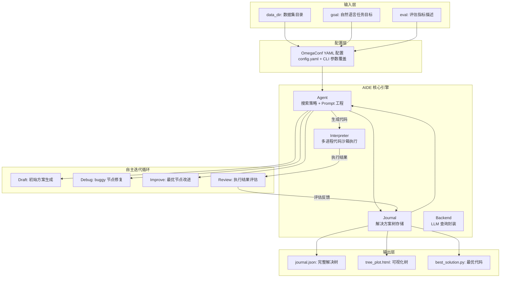

# Position Paper: AIDE (AI-Driven Exploration)

> **Owned Project**: AIDE (https://github.com/WecoAI/aideml)
> **License**: MIT | **Stars**: 1,285 | **Python**: 3.10+
> **Stance**: AIDE 是构建 MLagent_v2 探索模式的最优起点，没有之一。

---

## 1. 架构总览

### 1.1 Mermaid 架构图



### 1.2 主目录结构

```
aideml/
├── aide/
│   ├── __init__.py              # Experiment 类入口
│   ├── agent.py                 # Agent 核心：搜索策略 + Prompt 构建
│   ├── backend.py               # LLM 查询封装（OpenAI/Anthropic/Gemini/Ollama）
│   ├── interpreter.py           # 多进程 Python 代码沙箱执行
│   ├── journal.py               # Journal/Node 数据模型：解决树核心
│   ├── journal2report.py        # Journal → 自然语言报告
│   ├── run.py                   # CLI 入口（Rich TUI）
│   ├── tree_export.py           # 解决树 HTML 可视化
│   ├── utils/
│   │   ├── config.py            # OmegaConf 配置管理
│   │   ├── config.yaml          # 默认配置（steps, model, search 参数）
│   │   ├── metric.py            # MetricValue 可比较指标封装
│   │   ├── response.py          # LLM 响应解析（代码提取、文本截断）
│   │   ├── data_preview.py      # 数据目录预览生成
│   │   ├── copytree.py          # 工作区文件复制
│   │   ├── preproc_data.py      # 数据预处理（解压等）
│   │   ├── serialize.py         # JSON 序列化
│   │   └── viz_templates/       # HTML 可视化模板
│   └── example_tasks/           # 示例任务（bitcoin_price, house_prices）
├── .streamlit/                  # Streamlit Web UI 配置
├── sample_results/              # 示例运行结果
├── Dockerfile
├── setup.py                     # PyPI 包配置（aideml 0.2.2）
├── requirements.txt
└── README.md
```

---

## 2. 核心能力清单

### 2.1 树搜索驱动的自主探索

AIDE 的核心创新是**将 ML 代码生成问题建模为树搜索问题**。每个 Python 脚本是一个节点，节点之间存在三种关系：

- **Draft**（根节点）：从零生成的初始解决方案
- **Debug**（修复分支）：对 buggy 节点的修复尝试
- **Improve**（改进分支）：对 good 节点的单点改进

搜索策略（`Agent.search_policy()`）按以下优先级选择节点：
1. 初始阶段：生成 `num_drafts` 个独立 draft（默认 5 个）
2. 以 `debug_prob` 概率（默认 0.5）选择 buggy 节点进行 debug
3. 否则选择当前最优 good 节点进行 greedy 改进

**源码证据**（`aide/agent.py:49-82`）：
```python
def search_policy(self) -> Node | None:
    # initial drafting
    if len(self.journal.draft_nodes) < search_cfg.num_drafts:
        return None  # draft new node
    # debugging
    if random.random() < search_cfg.debug_prob:
        debuggable_nodes = [n for n in self.journal.buggy_nodes
                           if n.is_leaf and n.debug_depth <= search_cfg.max_debug_depth]
        if debuggable_nodes:
            return random.choice(debuggable_nodes)
    # greedy improvement
    return self.journal.get_best_node()
```

### 2.2 自动 Draft → Debug → Benchmark 循环

每个 `agent.step()` 完成一次完整的迭代：

1. **选择父节点**：`search_policy()` 决定是 draft / debug / improve
2. **生成代码**：LLM 根据 prompt 生成 plan + code（`plan_and_code_query()`）
3. **执行代码**：`Interpreter.run()` 在子进程中执行，捕获 stdout/stderr/异常
4. **评估结果**：`parse_exec_result()` 调用 LLM（feedback model）分析执行输出，提取 metric
5. **存储节点**：`journal.append()` 将新节点加入解决树

**源码证据**（`aide/__init__.py:43-48`）：
```python
def run(self, steps: int) -> Solution:
    for _i in range(steps):
        self.agent.step(exec_callback=self.interpreter.run)
        save_run(self.cfg, self.journal)
    best_node = self.journal.get_best_node(only_good=False)
    return Solution(code=best_node.code, valid_metric=best_node.metric.value)
```

### 2.3 指标驱动的任意目标优化

AIDE 支持**任意用户指定指标**的最大化或最小化。通过 `MetricValue` 类封装指标值，实现可比较性：

**源码证据**（`aide/utils/metric.py`）：
```python
@dataclass
@total_ordering
class MetricValue(DataClassJsonMixin):
    value: float | int | None
    maximize: bool | None = field(default=None, kw_only=True)

    def __gt__(self, other) -> bool:
        # True if self is BETTER (not necessarily larger)
        comp = self.value > other.value
        return comp if self.maximize else not comp
```

`WorstMetricValue` 子类确保 buggy 节点永远排在最后，`journal.get_best_node()` 始终返回最优解。

### 2.4 多进程沙箱代码执行

`Interpreter` 类使用 `multiprocessing.Process` 在隔离子进程中执行生成的 Python 代码：

- **stdout/stderr 捕获**：通过 `Queue` 重定向输出
- **超时控制**：`timeout` 参数（默认 3600s），超时时发送 SIGINT，5s 后强制 kill
- **异常追踪**：自动提取异常类型、信息、堆栈，支持 IPython 格式
- **工作区隔离**：每个实验有独立的 `workspace_dir/input` 和 `workspace_dir/working`

**源码证据**（`aide/interpreter.py:118-156`）：
```python
def _run_session(self, code_inq: Queue, result_outq: Queue, event_outq: Queue):
    self.child_proc_setup(result_outq)
    global_scope: dict = {}
    while True:
        code = code_inq.get()
        with open(self.agent_file_name, "w") as f:
            f.write(code)
        event_outq.put(("state:ready",))
        try:
            exec(compile(code, self.agent_file_name, "exec"), global_scope)
        except BaseException as e:
            # 捕获异常并格式化
            event_outq.put(("state:finished", e_cls_name, exc_info, exc_stack))
        else:
            event_outq.put(("state:finished", None, None, None))
```

### 2.5 多后端 LLM 支持

`backend.py` 封装了对 OpenAI、Anthropic、Gemini、Ollama 的调用，支持：
- 代码生成模型（`agent.code.model`，默认 `o4-mini`）
- 反馈评估模型（`agent.feedback.model`，默认 `gpt-4.1-mini`）
- 报告生成模型（`report.model`，默认 `gpt-4.1`）
- 温度、max_tokens 等参数独立配置

### 2.6 可视化与可复现性

- **HTML 树可视化**：`tree_plot.html` 交互式展示解决树结构
- **Rich CLI TUI**：实时显示解决树、进度条、当前状态
- **完整日志**：`journal.json` 存储所有节点（代码、执行结果、metric、父子关系）
- **最佳代码导出**：`best_solution.py` 可直接运行

---

## 3. 数据模型

### 3.1 Node（解决树节点）

```python
@dataclass(eq=False)
class Node(DataClassJsonMixin):
    code: str                      # 生成的 Python 代码
    plan: str                      # 自然语言方案描述
    step: int                      # 在 journal 中的序号
    id: str                        # UUID
    ctime: float                   # 创建时间戳
    parent: Optional["Node"]       # 父节点（None 表示 draft）
    children: set["Node"]          # 子节点集合
    _term_out: list[str]           # 执行终端输出
    exec_time: float               # 执行耗时
    exc_type: str | None           # 异常类型
    exc_info: dict | None          # 异常详细信息
    exc_stack: list[tuple] | None  # 异常堆栈
    analysis: str                  # LLM 评估分析文本
    metric: MetricValue            # 评估指标值
    is_buggy: bool                 # 是否被判定为 buggy
```

### 3.2 Journal（解决树存储）

```python
@dataclass
class Journal(DataClassJsonMixin):
    nodes: list[Node]              # 所有节点按生成顺序存储

    # 派生属性
    draft_nodes: list[Node]        # parent is None
    buggy_nodes: list[Node]        # is_buggy == True
    good_nodes: list[Node]         # is_buggy == False

    def get_best_node(self, only_good=True) -> Node:
        """返回 metric 最优的节点"""

    def generate_summary(self, include_code=False) -> str:
        """生成供 LLM 使用的历史经验摘要"""
```

### 3.3 Experiment（运行时封装）

```python
@dataclass
class Solution:
    code: str
    valid_metric: float

class Experiment:
    def __init__(self, data_dir: str, goal: str, eval: str | None = None):
        self.cfg = prep_cfg(...)       # OmegaConf 配置
        self.task_desc = load_task_desc(...)  # 任务描述
        self.journal = Journal()       # 空解决树
        self.agent = Agent(...)        # 代理实例
        self.interpreter = Interpreter(...)  # 执行器实例

    def run(self, steps: int) -> Solution:
        # 运行指定步数，返回最优解
```

### 3.4 Config（分层配置）

```yaml
# aide/utils/config.yaml
data_dir: null
goal: null
eval: null
log_dir: logs
workspace_dir: workspaces
exec:
  timeout: 3600
  agent_file_name: runfile.py
agent:
  steps: 20
  k_fold_validation: 5
  code:
    model: o4-mini
    temp: 0.5
  feedback:
    model: gpt-4.1-mini
    temp: 0.5
  search:
    max_debug_depth: 3
    debug_prob: 0.5
    num_drafts: 5
```

---

## 4. 扩展点

### 4.1 搜索策略可替换

`Agent.search_policy()` 是一个独立方法，可被覆盖以实现：
- **UCB/UCT 策略**：将解决树视为 MCTS，按置信上界选择节点
- **多样性优先**：优先探索不同 draft 分支而非 greedy 改进
- **记忆引导**：结合外部记忆库选择"有潜力但尚未尝试"的方向

### 4.2 Prompt 工程可配置

Agent 类将 prompt 构建拆分为多个 property：
- `_prompt_environment`：可用包列表（可扩展 NGS 专属包如 `pysam`, `biopython`）
- `_prompt_impl_guideline`：实现约束（可添加 NGS 数据处理规范）
- `_prompt_resp_fmt`：响应格式要求

### 4.3 后端模型可插拔

`backend.query()` 函数封装了所有 LLM 调用，支持：
- 替换为 Claude Agent SDK 的 `query()`（本项目 harness）
- 添加本地模型路由逻辑
- 实现请求缓存/重试/限流

### 4.4 执行器可扩展

`Interpreter` 类可扩展：
- **Docker 沙箱**：替换 multiprocessing 为容器执行（增强隔离）
- **GPU 资源管理**：为深度学习任务分配 GPU
- **分布式执行**：将代码发送到远程 worker 执行

### 4.5 配置系统完全开放

OmegaConf 支持 YAML + CLI 参数覆盖，所有超参数均可外部配置：
- `agent.steps`：探索轮数
- `agent.search.num_drafts`：初始 draft 数量
- `agent.search.debug_prob`：debug 概率
- `exec.timeout`：代码执行超时

---

## 5. 改造成本估算

### 5.1 改造范围（Fork → MLagent_v2 探索引擎）

| 改造项 | 工作量 | 风险 | 说明 |
|--------|--------|------|------|
| **替换 harness 为 Claude Agent SDK** | 3-4 人天 | 中 | `backend.py` 重写，将 `query()` 替换为 `claude_agent_sdk.query()`；需适配 tool use 格式 |
| **接入记忆系统（mem0 + SQLite）** | 5-7 人天 | 中 | 在 `Journal` 层外接持久化存储；修改 `generate_summary()` 从记忆库检索 |
| **添加 ipynb 导入接口** | 2-3 人天 | 低 | 新增 `notebook_loader.py`，解析 ipynb 为初始 draft 节点 |
| **NGS 工具包注入** | 2-3 人天 | 低 | 扩展 `_prompt_environment` 包含 `pysam`, `pyranges`, `biopython` |
| **Skill 复用集成** | 3-4 人天 | 中 | 将成功路径固化为 SKILL.md；修改搜索策略优先匹配 Skill |
| **Streamlit UI 替换** | 4-5 人天 | 低 | 替换原有 Streamlit 为 MLagent_v2 定制 UI |
| **对话式交互模式** | 3-4 人天 | 中 | 在 `Experiment.run()` 外添加交互循环，支持用户中途干预 |
| **测试与验证** | 3-4 人天 | 低 | 端到端测试、NGS 数据集验证 |

### 5.2 总估算

- **工作量**：25-34 人天（约 5-7 周，1 名工程师）
- **核心风险**：
  1. `backend.py` 与 Claude Agent SDK 的 tool use 格式差异（需适配成本）
  2. 记忆系统与 Journal 的语义对齐（记忆检索结果如何有效注入 prompt）
  3. 长实验中的 context window 管理（50+ 轮探索需要 compaction 策略）

---

## 6. 致命缺陷自述（强制）

### 缺陷 1：无原生持久化记忆——每次运行从零开始

**问题**：AIDE 的 `Journal` 完全驻留内存，实验结束后只保存为 `journal.json` 静态文件。下一次运行**不会自动加载**历史 journal，也不会从历史经验中学习。`generate_summary()` 只汇总当前实验的 good_nodes，不支持跨实验检索。

**源码证据**（`aide/journal.py:142-150`）：
```python
def generate_summary(self, include_code: bool = False) -> str:
    summary = []
    for n in self.good_nodes:
        summary_part = f"Design: {n.plan}\n"
        summary_part += f"Results: {n.analysis}\n"
        summary_part += f"Validation Metric: {n.metric.value}\n"
        summary.append(summary_part)
    return "\n-------------------------------\n".join(summary)
```

`generate_summary()` 只遍历 `self.good_nodes`（当前实验），没有外部记忆接口。这意味着如果昨天跑了一个甲基化分类实验，今天跑新的实验时，AIDE 完全不会参考昨天的结论。

**对 MLagent_v2 的影响**：必须外接 mem0/SQLite 记忆层，改造 `Agent` 类在每次 `step()` 前查询记忆库。这不是小改动，涉及 prompt 构建逻辑和 Journal 数据流的重构。

### 缺陷 2：搜索策略过于简单——纯随机 + greedy，无系统性探索保证

**问题**：`search_policy()` 使用 `random.choice()` 选择 debug 节点和 draft 节点，改进阶段纯 greedy。没有：
- UCB/Thompson Sampling 等平衡探索-利用的策略
- 对"已充分探索分支"的剪枝机制
- 对"相似方案"的去重检测

**源码证据**（`aide/agent.py:65-82`）：
```python
# debugging
if random.random() < search_cfg.debug_prob:
    debuggable_nodes = [...]
    if debuggable_nodes:
        return random.choice(debuggable_nodes)  # 纯随机！

# greedy
good_nodes = self.journal.good_nodes
if not good_nodes:
    return None
greedy_node = self.journal.get_best_node()  # 永远选当前最优
return greedy_node
```

在复杂特征空间（如 NGS 甲基化数据的 10K+ CpG 位点组合）中，纯 greedy 容易陷入局部最优，且随机 debug 不保证修复效率。

**对 MLagent_v2 的影响**：需要重写 `search_policy()`，引入 MCTS 或贝叶斯优化思想。这是核心算法改动，可能影响 AIDE 的基准稳定性。

### 缺陷 3：代码执行沙箱安全性不足——`exec()` 在子进程中运行，无真正隔离

**问题**：`Interpreter` 使用 `multiprocessing.Process` + `exec(compile(...))` 执行 LLM 生成的代码。虽然比直接 `exec()` 安全，但：
- 子进程与主进程共享文件系统（可删除任意文件）
- 没有网络隔离（LLM 生成的代码可以发起网络请求）
- 没有资源限制（CPU/内存无 cgroup 限制）
- `allowed_packages` 等白名单只在 prompt 中声明，无运行时强制

**源码证据**（`aide/interpreter.py:130-135`）：
```python
def child_proc_setup(self, result_outq: Queue) -> None:
    os.chdir(str(self.working_dir))
    sys.path.append(str(self.working_dir))
    sys.stdout = sys.stderr = RedirectQueue(result_outq)
    # 注意：没有 seccomp、没有 chroot、没有资源限制
```

对比 CAAFE 的 AST 白名单（`check_ast()` 运行时强制），AIDE 的安全模型是"信任 LLM 不会生成恶意代码"，这在自主运行场景中是不可接受的。

**对 MLagent_v2 的影响**：必须引入额外的安全层——要么集成 Docker 沙箱（如 OpenHands 的做法），要么移植 CAAFE 的 AST 白名单机制到 AIDE 的执行管道中。这增加了架构复杂度。

---

## 7. 与其他候选项目的集成可行性

### 7.1 vs CAAFE（特征工程）—— 可配合，互补关系

| 维度 | AIDE | CAAFE |
|------|------|-------|
| 定位 | 完整 ML 探索引擎 | 特征工程子模块 |
| 范围 | 模型选择 + 特征工程 + 超参数 | 仅特征生成 |
| 集成方式 | AIDE 的 Agent 可将 CAAFE 作为工具调用 | CAAFE 生成特征 → AIDE 评估完整 pipeline |

**集成路径**：在 AIDE 的 `_prompt_environment` 中添加 `caafe` 包，让 LLM 在需要特征工程时调用 `CAAFEClassifier`。或者将 CAAFE 的 `generate_features()` 封装为 AIDE 可调用的工具函数。

### 7.2 vs mem0（记忆系统）—— 必须集成，无冲突

mem0 是 AIDE 缺失记忆能力的完美补充。集成点：
- 每次 `journal.append()` 后，将节点信息写入 mem0
- `Agent.step()` 前，从 mem0 检索相似实验的经验，注入 prompt
- `generate_summary()` 扩展为从 mem0 查询跨实验摘要

无架构冲突，mem0 是插件式 API。

### 7.3 vs MLflow（实验追踪）—— 可配合，互补关系

AIDE 已有 `journal.json` 存储实验结果，但格式是 AIDE 专有的。MLflow 可作为：
- 结构化指标存储（AUC、accuracy、feature count）
- 与 mem0 配合：MLflow 存结构化数据，mem0 存语义经验

集成成本：在 `save_run()` 中添加 `mlflow.log_metric()` 调用。

### 7.4 vs OpenHands / SWE-agent（Agent Harness）—— 互斥，不集成

OpenHands 和 SWE-agent 都是完整的 agent harness，与 AIDE 的 Agent 层功能重叠。本项目已选定 Claude Agent SDK 作为 harness，不应再引入 OpenHands。

但可**参考**其沙箱设计（Docker 容器执行）来增强 AIDE 的 `Interpreter` 安全性。

### 7.5 vs Featuretools / OpenFE（特征工具）—— 可配合，工具调用关系

AIDE 的 LLM 已经可以在生成的代码中 `import featuretools`。只需在 `_prompt_environment` 中声明这些包可用，Agent 会自动决定何时使用。

无需代码级集成，只需在部署环境中 `pip install` 即可。

---

## 8. 结论

AIDE 是目前开源生态中**唯一经过大规模 benchmark 验证**（OpenAI MLE-Bench 75 赛题，4× 奖牌率）的 LLM 驱动 ML 自主探索引擎。其树搜索架构、指标驱动设计、多进程沙箱执行，与 MLagent_v2 的"探索模式"需求高度匹配。

Fork AIDE 后，核心改造集中在：
1. 接入 mem0/SQLite 记忆层（弥补缺陷 1）
2. 重写搜索策略引入系统性探索（弥补缺陷 2）
3. 增强代码执行安全性（弥补缺陷 3）

这三项改造的工作量可控（25-34 人天），且 AIDE 的 MIT 许可允许自由修改。AIDE 是 MLagent_v2 探索引擎的最优起点。
