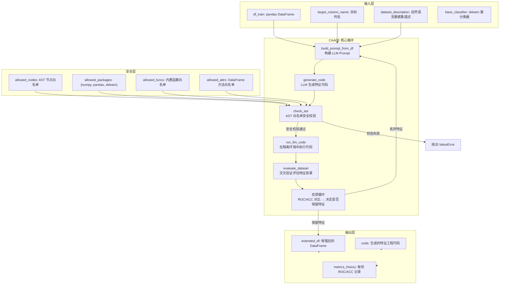

# Position Paper: CAAFE (Context-Aware Automated Feature Engineering)

> **Owned Project**: CAAFE (https://github.com/noahho/CAAFE)
> **License**: Apache-2.0 | **Stars**: 192 | **Python**: 3.7+
> **Stance**: CAAFE 的 LLM→特征生成→CV 评估→反馈循环设计，是 MLagent_v2 特征工程子系统的最优参考实现，其安全白名单机制更是自主代码执行场景的必选项。

---

## 1. 架构总览

### 1.1 Mermaid 架构图



### 1.2 主目录结构

```
CAAFE/
├── caafe/
│   ├── __init__.py              # 包入口（CAAFEClassifier 等）
│   ├── caafe.py                 # 核心：generate_features() + 反馈循环
│   ├── caafe_classifier.py      # CAAFEClassifier sklearn 兼容封装
│   ├── caafe_evaluate.py        # 数据集评估：交叉验证 + 指标计算
│   ├── run_llm_code.py          # LLM 代码执行 + AST 白名单安全校验
│   ├── preprocessing.py         # 数据预处理：类别编码、数值化
│   └── data.py                  # 数据集加载工具
├── data/                        # 示例数据集
├── scripts/                     # 运行脚本
├── tests/                       # 测试用例
├── setup.py                     # 包配置（caafe 0.1.5）
├── LICENSE.txt                  # Apache-2.0
└── README.md
```

---

## 2. 核心能力清单

### 2.1 LLM 基于数据集描述的语义化特征生成

CAAFE 的核心创新是**将特征工程问题转化为代码生成问题**，并通过自然语言数据集描述引导 LLM 生成语义相关的新特征。

Prompt 模板（`caafe/caafe.py:12-44`）包含：
- 数据集描述（用户提供的自然语言说明）
- 列信息（名称、数据类型、NaN 频率、样本值）
- 目标变量说明
- 代码格式约束（每个特征必须有注释说明用途）

**源码证据**（`caafe/caafe.py:12-44`）：
```python
def get_prompt(df, ds, iterative=1, data_description_unparsed=None, samples=None, **kwargs):
    return f"""
The dataframe `df` is loaded and in memory.
Description of the dataset in `df`:
"{data_description_unparsed}"
Columns in `df`:
{samples}
This code generates additional columns that are useful for a downstream classification algorithm predicting \"{ds[4][-1]}\".
Additional columns add new semantic information, that is they use real world knowledge on the dataset.
Code formatting for each added column:
```python
# (Feature name and description)
# Usefulness: (Description why this adds useful real world knowledge)
(Some pandas code using {df.columns[0]}', ... to add a new column)
```end
"""
```

### 2.2 交叉验证自动评估 + 反馈闭环

CAAFE 不是"生成即使用"，而是**每轮生成后都进行严格的交叉验证评估**：

1. **基线评估**：在原始特征上训练基分类器，记录 ROC/ACC
2. **增强评估**：在原始特征 + 新生成特征上训练，记录 ROC/ACC
3. **对比决策**：只有当 `improvement_roc + improvement_acc > 0` 时才保留新特征
4. **反馈生成**：将性能对比结果反馈给 LLM，指导下一轮生成

**源码证据**（`caafe/caafe.py:117-178`）：
```python
def execute_and_evaluate_code_block(full_code, code):
    ss = RepeatedKFold(n_splits=n_splits, n_repeats=n_repeats, random_state=0)
    for (train_idx, valid_idx) in ss.split(df):
        # 基线评估
        result_old = evaluate_dataset(df_train, df_valid, ..., method=iterative_method)
        # 增强评估
        result_extended = evaluate_dataset(df_train_extended, df_valid_extended, ..., method=iterative_method)
        old_rocs += [result_old["roc"]]
        old_accs += [result_old["acc"]]
        rocs += [result_extended["roc"]]
        accs += [result_extended["acc"]]

    improvement_roc = np.nanmean(rocs) - np.nanmean(old_rocs)
    improvement_acc = np.nanmean(accs) - np.nanmean(old_accs)
    add_feature = (improvement_roc + improvement_acc > 0)
```

### 2.3 运行时 AST 白名单安全校验

CAAFE 的**最大安全贡献**是 `check_ast()` 函数——在**执行前**对 LLM 生成的代码进行 AST 级白名单校验：

**源码证据**（`caafe/run_llm_code.py:58-148`）：
```python
def check_ast(node: ast.AST) -> None:
    allowed_nodes = {
        ast.Module, ast.Expr, ast.Load, ast.BinOp, ast.UnaryOp,
        ast.Add, ast.Sub, ast.Mult, ast.Div, ast.FloorDiv, ast.Mod, ast.Pow,
        ast.Num, ast.Str, ast.List, ast.Tuple, ast.Dict, ast.Name, ast.Call,
        ast.Assign, ast.If, ast.For, ast.While, ast.FunctionDef,
        ast.ListComp, ast.SetComp, ast.DictComp, ast.Lambda,
        ast.Import, ast.ImportFrom, ...
    }
    allowed_packages = {"numpy", "pandas", "sklearn"}
    allowed_funcs = {"sum", "min", "max", "abs", "round", "len", ...}
    allowed_attrs = {"mean", "sum", "std", "iloc", "groupby", "apply", ...}

    if type(node) not in allowed_nodes:
        raise ValueError(f"Disallowed code: {ast.unparse(node)} is {type(node)}")
    if isinstance(node, ast.Call) and isinstance(node.func, ast.Name):
        if node.func.id not in allowed_funcs:
            raise ValueError(f"Disallowed function: {node.func.id}")
    if isinstance(node, ast.Attribute) and node.attr not in allowed_attrs:
        raise ValueError(f"Disallowed attribute: {node.attr}")
    if isinstance(node, (ast.Import, ast.ImportFrom)):
        for alias in node.names:
            if alias.name not in allowed_packages:
                raise ValueError(f"Disallowed package import: {alias.name}")
    for child in ast.iter_child_nodes(node):
        check_ast(child)
```

这是**运行时强制**的安全机制，不是 prompt 中的"请安全编码"请求。任何不在白名单中的 AST 节点、函数、包导入都会立即抛出 `ValueError`。

### 2.4 sklearn 兼容封装

`CAAFEClassifier` 提供标准 sklearn 接口（`fit_pandas` / `predict`），可无缝集成到现有 ML pipeline：

```python
from caafe import CAAFEClassifier
from sklearn.ensemble import RandomForestClassifier

caafe_clf = CAAFEClassifier(
    base_classifier=RandomForestClassifier(n_estimators=100),
    llm_model="gpt-4",
    iterations=10
)
caafe_clf.fit_pandas(
    df_train,
    target_column_name="cancer_type",
    dataset_description="NGS methylation data for CNS tumor classification"
)
pred = caafe_clf.predict(df_test)
print(caafe_clf.code)  # 查看生成的特征工程代码
```

### 2.5 可解释的特征工程

CAAFE 生成的每个特征都包含：
- **特征名称和描述**（代码注释）
- **用途说明**（为什么这个特征对分类有用）
- **输入样本示例**（用于验证代码正确性）

这使得特征工程过程**完全可解释**，用户可以审查每个生成特征的合理性。

---

## 3. 数据模型

### 3.1 CAAFEClassifier（sklearn 兼容封装）

```python
class CAAFEClassifier:
    def __init__(self, base_classifier, llm_model, iterations):
        self.base_classifier = base_classifier  # sklearn 基分类器
        self.llm_model = llm_model              # LLM 模型名
        self.iterations = iterations            # 迭代次数
        self.code = ""                          # 累积生成的代码

    def fit_pandas(self, df_train, target_column_name, dataset_description):
        # 调用 generate_features() 生成特征
        # 在增强后的数据上训练 base_classifier

    def predict(self, df_test):
        # 应用 self.code 生成特征
        # 用 base_classifier 预测
```

### 3.2 generate_features 核心函数签名

```python
def generate_features(
    ds,                          # 数据集元数据
    df,                          # pandas DataFrame
    model="gpt-3.5-turbo",       # LLM 模型
    iterative=1,                 # 迭代次数
    metric_used=None,            # 评估指标
    iterative_method="logistic", # 基分类方法
    n_splits=10,                 # CV fold 数
    n_repeats=2,                 # CV 重复次数
):
    """
    返回: (full_code, prompt, messages)
    - full_code: 累积保留的所有有效特征生成代码
    - prompt: 使用的完整 prompt
    - messages: LLM 对话历史
    """
```

### 3.3 安全校验数据模型

```python
# run_llm_code.py 中的白名单集合
allowed_nodes: set[type[ast.AST]]     # 允许的 AST 节点类型
allowed_packages: set[str]             # 允许的导入包
allowed_funcs: set[str]                # 允许调用的函数
allowed_attrs: set[str]                # 允许访问的 DataFrame/ndarray 属性
```

### 3.4 评估结果结构

```python
{
    "acc": float,        # 准确率
    "roc": float,        # ROC AUC
    "prompt": str,       # prompt ID
    "seed": int,         # 随机种子
    "name": str,         # 数据集名称
    "size": int,         # 训练集大小
    "method": str,       # 分类方法
    "max_time": int,     # 最大训练时间
    "feats": int,        # 特征数量
}
```

---

## 4. 扩展点

### 4.1 Prompt 模板可定制

`get_prompt()` 和 `build_prompt_from_df()` 是独立函数，可被覆盖以：
- 注入 NGS 领域知识（如"CpG 位点甲基化水平"、"TSS 周围 2kb 区域"）
- 修改代码格式要求（如要求生成 `pysam` 代码而非纯 pandas）
- 添加特征约束（如"不要生成需要外部数据库查询的特征"）

### 4.2 白名单可扩展

`allowed_nodes` / `allowed_packages` / `allowed_funcs` / `allowed_attrs` 是模块级集合，可直接扩展：
- 添加 `pysam` 到 `allowed_packages`（NGS 数据读取）
- 添加 `read_bam` 到 `allowed_funcs`
- 添加 `biopython` 相关属性到 `allowed_attrs`

### 4.3 评估器可替换

`evaluate_dataset()` 支持多种基分类器：
- 字符串方法：`"logistic"`, `"xgb"`, `"random_forest"`, `"knn"`, `"catboost"`, `"gp"`
- sklearn 实例：任何 `BaseEstimator` 子类
- 自定义函数：任意符合签名的评估函数

### 4.4 反馈策略可配置

当前反馈策略是简单的 `improvement_roc + improvement_acc > 0`，可扩展为：
- 加权组合：`w1 * improvement_roc + w2 * improvement_acc > threshold`
- 统计显著性检验：要求 p < 0.05
- 特征数量惩罚：防止过度生成特征

### 4.5 LLM 后端可替换

`generate_code()` 使用 `openai.OpenAI()` 客户端，可替换为：
- Claude API（Anthropic Client SDK）
- 本地模型（Ollama / vLLM）
- 任意 OpenAI 兼容端点

---

## 5. 改造成本估算

### 5.1 改造范围（拆出核心逻辑 → MLagent_v2 特征工程子系统）

| 改造项 | 工作量 | 风险 | 说明 |
|--------|--------|------|------|
| **提取核心循环为独立模块** | 1-2 人天 | 低 | `generate_features()` 已相对独立，只需解耦 `caafe.py` 中的全局依赖 |
| **替换 OpenAI 客户端为 Claude SDK** | 1-2 人天 | 低 | `generate_code()` 函数内替换 API 调用 |
| **扩展 NGS 白名单** | 1-2 人天 | 低 | 添加 `pysam`, `biopython`, `pyranges` 到 allowed_packages 和 allowed_attrs |
| **NGS 领域 Prompt 模板** | 2-3 人天 | 中 | 重写 `get_prompt()` 注入基因组学知识 |
| **接入记忆系统** | 2-3 人天 | 中 | 将成功的特征生成代码存入 mem0，供后续任务检索 |
| **与 AIDE 探索引擎集成** | 2-3 人天 | 中 | 将 CAAFE 封装为 AIDE Agent 可调用的工具 |
| **批量特征生成模式** | 2-3 人天 | 低 | 当前是逐轮生成，需支持"一次生成多个特征候选"模式 |
| **测试与验证** | 2-3 人天 | 低 | NGS 数据集上的端到端测试 |

### 5.2 总估算

- **工作量**：13-21 人天（约 3-4 周，1 名工程师）
- **核心风险**：
  1. NGS 数据的特殊性（高维稀疏、批次效应）可能导致 CV 评估不稳定
  2. LLM 生成代码的多样性受限于白名单，过度扩展白名单会降低安全性
  3. 与 AIDE 的集成需要统一"特征生成 → 完整 pipeline 评估"的接口契约

---

## 6. 致命缺陷自述（强制）

### 缺陷 1：无自主探索主循环——仅做特征工程，不做模型选择和超参数优化

**问题**：CAAFE 的定位是"特征工程工具"，不是"ML 探索 Agent"。它：
- 不选择模型（基分类器由用户预先指定）
- 不优化超参数
- 不做特征选择（只生成新特征，不系统性地评估子集）
- 没有"探索-利用"的决策逻辑

**源码证据**（`caafe/caafe.py:178-210`）：
```python
# 反馈消息只包含性能对比，没有指导 LLM 改变策略
messages += [
    {"role": "assistant", "content": code},
    {"role": "user", "content": f"""Performance after adding feature ROC {np.nanmean(rocs):.3f}, ACC {np.nanmean(accs):.3f}.
{add_feature_sentence}
Next codeblock:
"""},
]
```

反馈消息只是告诉 LLM"上一个特征好/不好，请继续"，没有：
- 分析为什么某个特征有效/无效
- 建议尝试不同的特征类型
- 调整生成策略（如从"组合特征"转向"聚合特征"）

**对 MLagent_v2 的影响**：CAAFE 不能作为探索引擎的主循环，只能作为特征工程子工具。必须将其嵌入 AIDE 或自研的探索框架中，由上层 Agent 决定"何时调用 CAAFE"、"用哪个基分类器评估"、"生成多少轮后停止"。

### 缺陷 2：强依赖 TabPFN 评估管道——不适合大型 NGS 数据集

**问题**：CAAFE 的 `evaluate_dataset()` 深度耦合 TabPFN 的评估基础设施：

**源码证据**（`caafe/caafe_evaluate.py:1-60`）：
```python
import tabpfn
from tabpfn.scripts.tabular_baselines import (
    xgb_metric, random_forest_metric, logistic_metric, ...
)
from tabpfn.scripts.tabular_metrics import accuracy_metric, auc_metric

def evaluate_dataset(df_train, df_test, ...):
    # ...
    metric, ys, res = clf(x, y, test_x, test_y, [], metric_used, max_time=max_time)
    acc = tabpfn.scripts.tabular_metrics.accuracy_metric(test_y, ys)
    roc = tabpfn.scripts.tabular_metrics.auc_metric(test_y, ys)
```

TabPFN 的设计约束：
- 仅适合小型表格数据集（< 10K 样本，< 100 特征）
- NGS 甲基化数据通常是 100+ 样本 × 10K+ CpG 位点，远超 TabPFN 的舒适区
- `tabpfn.scripts.tabular_baselines` 的接口不稳定，依赖特定版本

**对 MLagent_v2 的影响**：必须彻底替换评估后端，使用 sklearn 原生的 `cross_val_score` + `XGBClassifier` 或 `RandomForestClassifier`。这不是配置修改，而是 `caafe_evaluate.py` 的重写。

### 缺陷 3：社区活跃度极低——192 Stars，最后 commit 2024-12-20，维护存疑

**问题**：
- **Stars 仅 192**：对比 AIDE（1,285）、OpenFE（870），社区关注度极低
- **最后 commit 2024-12-20**：已超过 5 个月无更新
- **setup.py 中的依赖版本锁定**：`openai==0.28`（OpenAI Python SDK 已发布 1.x 大版本）
- **Python 版本声明 3.7+**：但 `openai==0.28` 在新 Python 版本上可能有兼容性问题

**源码证据**（`setup.py:12-20`）：
```python
setup(
    name="caafe",
    version="0.1.5",
    install_requires=[
        "openai==0.28",      # 严重过时！当前是 1.x
        "kaggle",
        "openml==0.12.0",
        "tabpfn",
    ],
    python_requires=">=3.7",
)
```

**对 MLagent_v2 的影响**：
- 不能依赖上游维护，所有 bug 修复和依赖升级需自行处理
- `openai==0.28` 必须升级到最新版（或替换为 Claude SDK），涉及 API 调用方式变更
- 没有活跃的 issue/PR 社区，遇到边缘情况无参考解决方案

---

## 7. 与其他候选项目的集成可行性

### 7.1 vs AIDE（探索引擎）—— 可配合，上下层关系

| 维度 | CAAFE | AIDE |
|------|-------|------|
| 定位 | 特征工程子工具 | 完整探索引擎 |
| 决策能力 | 无 | 树搜索 + 自主决策 |
| 集成方式 | 被 AIDE 调用 | 调用 CAAFE 作为工具 |

**集成路径**：
1. 将 CAAFE 的 `generate_features()` 封装为 AIDE Agent 的可用工具
2. AIDE 的 LLM 在需要特征工程时生成调用 CAAFE 的代码
3. CAAFE 生成的特征代码作为 AIDE 解决树中的一个"改进方向"

**价值**：AIDE 提供"何时做特征工程"的决策能力，CAAFE 提供"如何做特征工程"的实现能力。两者互补。

### 7.2 vs mem0（记忆系统）—— 可配合，增强特征复用

CAAFE 本身无记忆能力，但可与 mem0 集成：
- 将成功的特征生成代码（`caafe_clf.code`）存入 mem0
- 新任务开始时，从 mem0 检索相似数据集的历史特征代码
- 将检索到的代码作为 few-shot example 注入 CAAFE 的 prompt

### 7.3 vs OpenFE / Featuretools（特征工具）—— 部分互斥，部分互补

| 工具 | 特征生成方式 | 与 CAAFE 关系 |
|------|-------------|--------------|
| CAAFE | LLM 语义驱动 | 生成有语义解释的特征 |
| OpenFE | 算法组合（23 种操作符）| 批量生成无解释的特征 |
| Featuretools | 深度特征合成（DFS）| 多表关系型数据特征 |

**互补场景**：
- CAAFE 负责"语义特征"（需要领域知识理解的特征）
- OpenFE 负责"算法特征"（数学变换、组合）
- Featuretools 负责"关系特征"（多表 join、聚合）

**互斥场景**：三者都可以生成"组合特征"，在资源有限时可能重复。

### 7.4 vs MLflow（实验追踪）—— 可配合，记录特征工程历史

CAAFE 的每轮迭代结果（ROC/ACC 改进）可写入 MLflow：
- `mlflow.log_metric("caafe_roc_improvement", improvement_roc)`
- `mlflow.log_param("caafe_iteration", i)`
- `mlflow.log_artifact("caafe_generated_code.py", caafe_clf.code)`

### 7.5 vs OpenHands / SWE-agent（Agent Harness）—— 无直接关系

CAAFE 是工具库，不是 Agent。与 harness 的选择无关，可在任何 harness（Claude Agent SDK / OpenHands / 自研）中被调用。

---

## 8. 结论

CAAFE 的核心价值不在于它是一个完整的 ML Agent，而在于它**定义了一个经过验证的 LLM 驱动特征工程范式**：

1. **语义化特征生成**：用自然语言数据集描述引导 LLM 生成有意义的特征
2. **严格的质量验证**：每轮交叉验证评估，只有真正提升性能的特征才被保留
3. **运行时安全保证**：AST 白名单机制是自主代码执行场景的必选项

对于 MLagent_v2，CAAFE 不应被 fork 为整体，而应**拆出核心逻辑**：
- `generate_features()` 的循环设计
- `check_ast()` 的安全校验机制
- `build_prompt_from_df()` 的 prompt 工程方法

这些组件可作为 MLagent_v2 探索模式中"特征工程子任务"的实现参考，预计改造工作量 13-21 人天。CAAFE 的 Apache-2.0 许可允许自由使用和修改。

**最关键的借鉴**：CAAFE 的 AST 白名单安全模型应当被移植到 MLagent_v2 的所有自主代码执行场景中——无论最终选择 AIDE 还是自研探索引擎，**运行时代码安全校验都是不可妥协的底线**。
