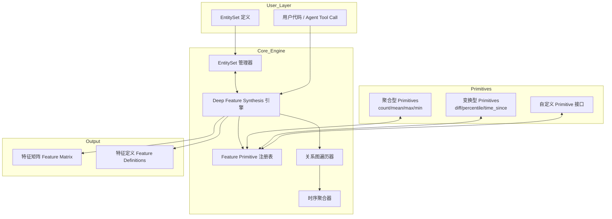

# Position Paper: Featuretools

## Candidate Metadata

| Field | Value |
|---|---|
| Repository | https://github.com/alteryx/featuretools |
| License | BSD-3-Clause |
| Stars | 7,648 |
| Language | Python |
| Last Commit | 2026-02-03 |
| Core Value | Deep Feature Synthesis (DFS) — automated feature engineering from multi-table relational datasets |

---

## 1. 架构总览

### 1.1 Mermaid 架构图



### 1.2 主目录结构（推断）

```
featuretools/
├── featuretools/
│   ├── __init__.py
│   ├── entityset/           # EntitySet 核心：多表关系管理
│   │   ├── entityset.py     # EntitySet 主类
│   │   ├── entity.py        # 单表 Entity 定义
│   │   └── relationship.py  # 表间关系定义
│   ├── dfs.py               # Deep Feature Synthesis 入口
│   ├── primitives/          # 特征算子库
│   │   ├── aggregation/     # 聚合型（跨表）
│   │   ├── transformation/  # 变换型（单表）
│   │   └── base/            # 基类与注册机制
│   ├── computational_backends/
│   │   ├── pandas_backend.py
│   │   └── spark_backend.py # 可选分布式后端
│   ├── feature_base/        # Feature 对象体系
│   ├── selection/           # 特征选择（可选）
│   └── tests/
├── docs/
└── setup.py / pyproject.toml
```

---

## 2. 核心能力清单

| 能力 | 说明 | 对 MLagent_v2 的价值 |
|---|---|---|
| 深度特征合成（DFS） | 基于多表关系图自动递归生成派生特征 | 低 — NGS 数据通常为单矩阵 |
| 时序事务聚合 | 对时间序列事务表按窗口做统计聚合 | 中 — 若 NGS 有 panel 数据可复用 |
| 特征算子库（~100+） | 内置 count/mean/std/percentile/time_since 等 | 中 — 算子本身可借鉴 |
| 自定义 Primitive | 通过继承基类注册新算子 | 高 — 可封装为 agent 工具 |
| 多计算后端 | Pandas / Spark / Dask | 低 — 本地部署场景 |
| 特征可解释性 | 每个特征保留完整血缘（synthesis path） | 高 — 便于 agent 向用户解释 |
| EntitySet 序列化 | 数据结构可保存/加载 | 低 — 非核心需求 |

---

## 3. 数据模型

### 3.1 关键类/接口推断

```python
# EntitySet — 多表关系容器
class EntitySet:
    def __init__(self, id: str)
    def entity_from_dataframe(
        self,
        entity_id: str,
        dataframe: pd.DataFrame,
        index: str,               # 主键列
        time_index: str = None,   # 时序索引
        variable_types: dict = None
    ) -> Entity
    def add_relationship(self, relationship: Relationship) -> None
    def find_path(self, start: str, end: str) -> List[Relationship]

# Entity — 单表实体
class Entity:
    id: str
    df: pd.DataFrame
    index: str
    time_index: Optional[str]
    variables: List[Variable]

# Relationship — 表间关系（外键关联）
class Relationship:
    parent_entity: str
    parent_variable: str
    child_entity: str
    child_variable: str

# DFS 入口函数
class DeepFeatureSynthesis:
    def __init__(
        self,
        target_entity: str,           # 目标表（要生成特征的表）
        entityset: EntitySet,
        agg_primitives: List[str],    # 聚合算子白名单
        trans_primitives: List[str],  # 变换算子白名单
        max_depth: int = 2            # 递归深度
    )
    def run(self) -> (pd.DataFrame, List[FeatureBase])

# Primitive 基类（扩展点）
class PrimitiveBase:
    name: str
    input_types: List[VariableType]
    return_type: VariableType
    def get_function(self) -> Callable

class AggregationPrimitive(PrimitiveBase): ...
class TransformPrimitive(PrimitiveBase): ...

# Feature 定义对象（输出侧）
class FeatureBase:
    @property
    def generate_name(self) -> str
    @property
    def depth(self) -> int           # 合成深度
    def get_dependencies(self) -> List[FeatureBase]
```

---

## 4. 扩展点

| 扩展点 | 机制 | 改造成 agent 工具的难易度 |
|---|---|---|
| 自定义 Primitive | 继承 `AggregationPrimitive` 或 `TransformPrimitive`，重写 `get_function()` | 易 — 单个 Python 类即可 |
| 算子白名单 | `agg_primitives` / `trans_primitives` 参数控制 | 易 — 直接映射为 tool 参数 |
| 递归深度 | `max_depth` 参数 | 易 |
| 变量类型系统 | `variable_types` 字典覆盖自动推断 | 中 |
| 计算后端 | 可插拔 backend 接口 | 难 — 需理解内部抽象 |
| 特征选择后处理 | 输出 `FeatureMatrix` 后自行过滤 | 易 — 在 agent 层处理 |

### Agent 工具封装设想

```python
# 伪代码：封装为 Claude Agent SDK 工具
@tool
def featuretools_synthesize_features(
    dataframe: pd.DataFrame,
    target_column: str,
    primitives: List[str] = ["count", "mean", "std", "max", "min"],
    max_depth: int = 2
) -> pd.DataFrame:
    """
    对单表数据执行自动特征合成。
    内部构造单 Entity EntitySet，绕过多表要求。
    """
    ...
```

---

## 5. 改造成本估算

| 成本项 | 评估 | 说明 |
|---|---|---|
| 安装成本 | 极低 | `pip install featuretools`，无额外系统依赖 |
| 单表适配成本 | 中 | 需包装层：将单 DataFrame 包装为单 Entity 的 EntitySet，屏蔽多表概念 |
| API 封装成本 | 低 | DFS 入口函数参数清晰，可直接映射为 tool schema |
| 学习成本 | 中 | EntitySet / Entity / Relationship 概念对 NGS 用户是认知负担 |
| 运行时成本 | 低-中 | Pandas 后端本地运行；特征爆炸时需控制 `max_depth` 和算子白名单 |
| 维护成本 | 低 | Alteryx 持续维护，社区成熟 |
| **总估算** | **中低** | 主要成本在“单表适配包装层”，非 fork 而是 wrapper |

---

## 6. 致命缺陷自述（强制 3 条）

### 缺陷 1：多表关系型数据结构是架构级假设，NGS 数据通常是单矩阵

Featuretools 的核心抽象 `EntitySet` 是为多表关系型数据（如电商的用户-订单-商品）设计的。NGS（Next-Generation Sequencing）ML 分类任务的数据通常是：
- 一个样本 x 特征矩阵（VCF 变异注释后的扁平表）
- 或一个样本 x 序列 x 位置的 3D 张量

强行将单矩阵包装为单 Entity 的 EntitySet 是“削足适履”，所有关系图遍历、跨表聚合的核心优势被浪费，仅剩下算子库的价值。

### 缺陷 2：已进入“维护模式”，无 LLM/Agent 原生集成

Alteryx 收购后 Featuretools 的定位是商业产品底层库。社区活跃度（7,648 stars 但 issue/PR 响应慢）和演进方向均指向“稳定维护”而非“创新扩展”。没有 LLM 集成、没有 agent loop 支持、没有自然语言特征描述能力。在 AI Agent 时代，它是一个“上一代”工具。

### 缺陷 3：时序聚合面向“事务记录”而非“序列生物学信号”

Featuretools 的时序能力假设数据是离散事务（如交易记录、日志事件），通过 `time_index` 和聚合窗口做统计。NGS 数据中的时序/序列概念是：
- 基因组位置上的连续信号（coverage, methylation）
- 碱基序列的 k-mer 模式
- 变异在样本间的共现模式

这些不是“事务表”，Featuretools 的时序原语（time_since_last, trend）对生物学序列信号几乎无直接适用性。

---

## 7. 与其他候选项目的集成可行性

| 候选项目 | 集成可行性 | 说明 |
|---|---|---|
| **OpenFE** | 低 | 两者都是特征工程库，功能重叠度高，无互补性 |
| **Auto-sklearn / FLAML** | 中 | Featuretools 生成特征矩阵后，可作为输入喂给 AutoML 框架；但 MLagent_v2 若自带模型训练，此链路冗余 |
| **Claude Agent SDK** | 中 | 需包装层将 DFS 封装为 tool；Featuretools 无原生 async/LLM 接口 |
| **NGS 专用库（pysam, cyvcf2）** | 低 | Featuretools 只接受 DataFrame，NGS 原始数据需先 ETL 为表格，丢失生物学语义 |
| **MCP Servers（如 muyu-search）** | 低 | 无直接关联，特征工程是本地计算任务 |

### 综合评估

Featuretools 是一个**成熟但错位**的候选。它的架构假设（多表关系型数据、事务时序）与 NGS ML 分类任务的数据形态不匹配。若强行集成，核心价值仅剩“算子库 + 可解释性”，但为此引入 EntitySet 概念体系是过度设计。建议**仅在 NGS 数据明确存在多表关系场景时考虑**，否则优先级低于 OpenFE 或更轻量的方案。
