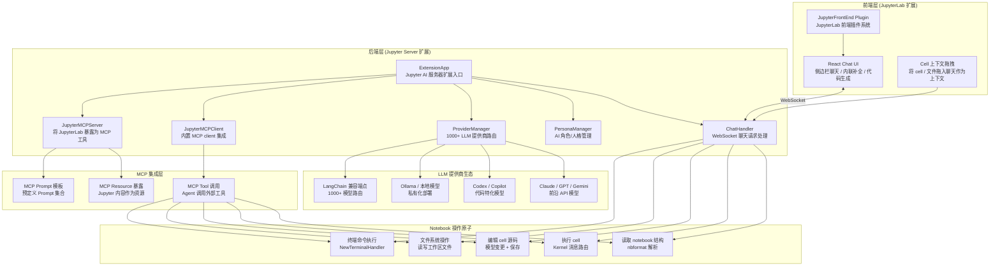

# Position Paper: Jupyter AI

> **Owned Project**: Jupyter AI (https://github.com/jupyterlab/jupyter-ai)
> **License**: BSD-3-Clause | **Stars**: 4,237 | **Python**: JupyterLab 扩展
> **Stance**: Jupyter AI 是 MLagent_v2「ipynb 交互层 + MCP server 设计模式」的最优参考实现——原生 Chat UI 集成 1000+ LLM，内置 Jupyter MCP server，其 notebook 读写/执行接口设计是历史实验经验导入功能的关键技术参考。

---

## 1. 架构总览

### 1.1 Mermaid 架构图



### 1.2 主目录结构

```
jupyter-ai/
├── packages/
│   ├── jupyter-ai/                 # 核心 Python 包
│   │   ├── extension.py            # ExtensionApp 入口 (~1200 行)
│   │   ├── chat_handlers/          # WebSocket 聊天处理器
│   │   │   ├── base.py             # ChatHandler 基类
│   │   │   ├── default.py          # 默认聊天逻辑
│   │   │   ├── learn.py            # /learn 命令：索引文件为上下文
│   │   │   ├── generate.py         # /generate 命令：代码生成
│   │   │   └── export.py           # /export 命令：导出对话为 notebook
│   │   ├── providers/              # LLM 提供商适配器
│   │   │   ├── base.py             # BaseProvider 抽象
│   │   │   ├── anthropic.py        # Claude 适配
│   │   │   ├── openai.py           # GPT 适配
│   │   │   ├── gemini.py           # Gemini 适配
│   │   │   └── ...                 # 其他 20+ 提供商
│   │   ├── persona/                # AI 角色/人格系统
│   │   │   ├── models.py           # Persona 数据模型
│   │   │   └── manager.py          # PersonaManager CRUD
│   │   ├── mcp/                    # MCP 集成模块
│   │   │   ├── client.py           # JupyterMCPClient：调用外部 MCP server
│   │   │   ├── server.py           # JupyterMCPServer：将 Jupyter 暴露为 MCP 工具
│   │   │   └── tools.py            # MCP tool 定义（notebook 操作原子）
│   │   ├── magics/                 # IPython Magic 命令
│   │   │   └── ai.py               # %%ai magic：cell 级 LLM 调用
│   │   ├── tasks/                  # 异步任务队列
│   │   ├── models/                 # 共享数据模型
│   │   └── tests/                  # 测试套件
│   ├── jupyter-ai-magics/          # 独立 magic 命令包
│   └── jupyter-ai-core/            # 核心类型定义（前端共享）
├── src/                            # TypeScript/React 前端
│   ├── chat/                       # 聊天 UI 组件
│   ├── components/                 # 共享组件
│   └── tokens.ts                   # 前端类型定义
├── pyproject.toml                  # 单体仓库配置
├── package.json                    # JupyterLab 扩展配置
└── README.md
```

---

## 2. 核心能力清单

### 2.1 1000+ LLM 原生集成（Provider 架构）

Jupyter AI 的 `ProviderManager` 通过统一的 `BaseProvider` 接口封装了 20+ 提供商适配器，覆盖 1000+ 模型：

**设计模式**（`jupyter_ai/providers/base.py`）：
```python
class BaseProvider(BaseModel):
    """所有 LLM 提供商的抽象基类。"""
    id: str
    name: str
    models: List[str]
    help: str
    auth_strategy: AuthStrategy

    async def generate(self, prompt: str, chat_history: List[dict]) -> str:
        """生成响应，由子类实现。"""
        raise NotImplementedError
```

**已适配提供商**：Anthropic Claude、OpenAI GPT、Google Gemini、Azure OpenAI、Amazon Bedrock、HuggingFace、Ollama、Cohere、AI21、Together 等。

**对 MLagent_v2 的价值**：其 Provider 架构可作为「多模型路由层」的设计参考——当 Claude API 限流时自动降级到本地 Ollama 模型。

### 2.2 Notebook 操作原子（MCP Tool 层）

Jupyter AI 将 JupyterLab 的核心操作封装为 MCP tool，使外部 Agent 能够：

| Tool | 功能 | 对应 MLagent_v2 需求 |
|------|------|---------------------|
| `read_notebook` | 读取 .ipynb 文件结构和 cell 内容 | **历史实验导入**：解析用户过往 notebook |
| `execute_cell` | 执行指定 cell 并捕获输出 | **交互训练**：Agent 运行训练代码 |
| `edit_cell` | 修改 cell 源码 | **代码迭代**：Agent 修正训练脚本 |
| `add_cell` | 在指定位置插入新 cell | **实验记录**：Agent 追加结果分析 |
| `read_file` | 读取工作区任意文件 | **数据检查**：查看数据集元数据 |
| `execute_terminal` | 执行 shell 命令 | **环境管理**：安装依赖、运行脚本 |

**对 MLagent_v2 的价值**：这些操作原子是「ipynb 导入」功能的技术基础——MLagent_v2 可以通过 Jupyter MCP server 让 Claude Code 读取用户历史 notebook，提取实验经验。

### 2.3 内置 Jupyter MCP Server

Jupyter AI 的独特贡献是**双向 MCP 集成**：

- **MCP Client 模式**（`jupyter_ai/mcp/client.py`）：Jupyter AI 作为 client，调用外部 MCP server（如文件系统、数据库、Web 搜索）
- **MCP Server 模式**（`jupyter_ai/mcp/server.py`）：JupyterLab 作为 server，将 notebook 操作暴露为 MCP tool 供外部 Agent 调用

**对 MLagent_v2 的价值**：
- **ipynb 导入场景**：Claude Code（MCP client）→ Jupyter MCP server → 读取用户历史 notebook → 提取特征工程经验、模型参数、评估结果
- **交互训练场景**：Claude Code（MCP client）→ Jupyter MCP server → 创建新 notebook → 写入训练代码 → 执行并获取结果

### 2.4 多用户实时协作与授权机制

Jupyter AI 支持 JupyterHub 多用户环境：
- 每个用户有独立的聊天历史和 AI 配置
- **敏感操作需用户授权**：文件删除、终端命令执行等危险操作弹出确认对话框
- 管理员可配置全局默认模型和禁用特定提供商

**对 MLagent_v2 的价值**：其「敏感操作授权」设计模式可直接借鉴——在本地单用户场景中，可降级为「高风险操作日志记录 + 用户事后审查」机制。

### 2.5 /learn 命令：文件索引与 RAG 上下文

Jupyter AI 的 `/learn` 命令将工作区文件索引为向量数据库，后续聊天可自动检索相关文件作为上下文：

```
/learn ./data/                    # 索引 data 目录
/learn ./experiments/*.ipynb      # 索引所有 notebook
```

**对 MLagent_v2 的价值**：这是「历史实验经验导入」的简化版实现——将 notebook 索引为向量库，通过语义检索找到相似实验。但 Jupyter AI 的 RAG 是单次会话的，不持久化，需配合 mem0 实现跨会话记忆。

### 2.6 Persona 系统（AI 角色定制）

`PersonaManager` 允许定义不同的 AI 角色：

```python
# 内置 Persona 示例
{
    "name": "default",
    "system_prompt": "You are a helpful assistant..."
}
{
    "name": "code-expert",
    "system_prompt": "You are an expert Python data scientist..."
}
```

**对 MLagent_v2 的价值**：可定义 NGS 领域专属 Persona（如 "ngs-methylation-expert"），在 system prompt 中注入基因组学知识。

---

## 3. 数据模型

### 3.1 ChatMessage（聊天消息）

```python
@dataclass
class ChatMessage:
    id: str                         # 消息唯一 ID
    body: str                       # 消息内容（Markdown）
    sender: ChatMessageSender       # human / agent
    timestamp: int                  # 时间戳（毫秒）
    persona: Optional[str]          # 使用的角色名
    prompt_tokens: Optional[int]    # 输入 token 数
    completion_tokens: Optional[int] # 输出 token 数
    error: Optional[str]            # 错误信息
```

### 3.2 Persona（AI 角色）

```python
@dataclass
class Persona:
    id: str                         # 唯一标识
    name: str                       # 显示名称
    description: str                # 描述
    system_prompt: str              # 系统提示词
    allowed_providers: List[str]    # 允许的 LLM 提供商
```

### 3.3 BaseProvider（提供商抽象）

```python
class BaseProvider(BaseModel):
    id: str                         # 提供商 ID（如 "anthropic"）
    name: str                       # 显示名称
    model_id: str                   # 模型 ID（如 "claude-sonnet-4"）
    models: List[str]               # 支持的模型列表
    help: str                       # 帮助文档
    auth_strategy: AuthStrategy     # 认证策略（env / token / none）

    async def generate(self, prompt: str, chat_history: List[dict]) -> str:
        """异步生成响应"""
```

### 3.4 MCPTool（MCP 工具定义）

```python
@dataclass
class MCPTool:
    name: str                       # 工具名称
    description: str                # 工具描述（LLM 可见）
    input_schema: dict              # JSON Schema 输入参数定义
    handler: Callable               # 工具执行函数
```

### 3.5 MLagent_v2 映射

| Jupyter AI 概念 | MLagent_v2 映射 | 说明 |
|----------------|----------------|------|
| `JupyterMCPServer` | ipynb 导入接口 | 通过 MCP 读取历史 notebook |
| `read_notebook` tool | 实验经验提取 | 解析 cell 中的训练代码和结果 |
| `execute_cell` tool | 交互训练执行 | Agent 运行训练代码并获取输出 |
| `Persona` | 领域专家角色 | NGS 甲基化分类专家角色 |
| `ProviderManager` | 模型路由层 | Claude 主模型 + Ollama 降级 |
| `/learn` 索引 | 实验 RAG | 将 notebook 索引为语义检索库 |
| `ChatMessage` | 对话历史 | 与 mem0 的对话记录对齐 |

---

## 4. 扩展点

### 4.1 自定义 Provider 适配器

通过继承 `BaseProvider` 添加新的 LLM 后端：

```python
class ClaudeAgentSDKProvider(BaseProvider):
    """适配 Claude Agent SDK 作为 Jupyter AI 的 LLM 后端"""
    id = "claude-agent-sdk"
    name = "Claude Agent SDK"
    models = ["claude-sonnet-4", "claude-haiku-4"]

    async def generate(self, prompt: str, chat_history: List[dict]) -> str:
        # 调用 Claude Agent SDK 的 query()
        return await claude_agent_sdk.query(prompt, tools=self.tools)
```

### 4.2 自定义 MCP Tool

在 `JupyterMCPServer` 中添加 NGS 特化工具：

```python
# 新增 NGS 工具
@mcp_tool
async def read_bam_header(bam_path: str) -> dict:
    """读取 BAM 文件的 header 信息，返回参考序列列表。"""
    import pysam
    with pysam.AlignmentFile(bam_path, "rb") as bam:
        return {"references": bam.references, "lengths": bam.lengths}

@mcp_tool
async def extract_methylation_features(bed_path: str, cpg_islands: str) -> pd.DataFrame:
    """从 BED 文件提取 CpG 岛甲基化特征。"""
    ...
```

### 4.3 Persona 模板扩展

添加 NGS 领域专属 Persona：

```python
NGS_PERSONA = {
    "id": "ngs-methylation-expert",
    "name": "NGS Methylation Expert",
    "description": "NGS 甲基化数据分类专家",
    "system_prompt": """You are an expert in NGS methylation data analysis and machine learning classification.
    You specialize in:
    - CpG island methylation pattern extraction
    - Batch effect correction (ComBat, RUV)
    - Beta-value normalization
    - Feature selection for high-dimensional methylation data (10K+ CpG sites)
    - XGBoost / RandomForest classification for CNS tumor subtyping
    """
}
```

### 4.4 /learn 索引策略定制

自定义文件索引过滤器，只索引与实验相关的文件：

```python
# 只索引 notebook 和 Python 脚本
LEARN_FILTERS = {
    "include": ["*.ipynb", "*.py", "*.yaml", "*.json"],
    "exclude": ["*.csv", "*.bam", "*.fastq", "__pycache__"]
}
```

### 4.5 授权策略配置

通过 traitlet 配置敏感操作授权级别：

```python
c.JupyterAIConfig.sensitive_operations = {
    "file_delete": "require_approval",      # 需用户确认
    "terminal_execute": "log_only",         # 仅记录日志
    "notebook_save": "auto",                # 自动执行
}
```

---

## 5. 改造成本估算

### 5.1 改造范围（学习设计模式 → MLagent_v2 ipynb 交互层）

> **注意**：Jupyter AI 的改造是「学习成本」而非「fork 成本」。MLagent_v2 不直接集成 Jupyter AI，而是学习其 MCP server 设计模式和 notebook 操作原子，在 Claude Agent SDK harness 中自研实现。

| 改造项 | 工作量 | 风险 | 说明 |
|--------|--------|------|------|
| **研读 Jupyter AI MCP server 设计** | 2-3 人天 | 低 | 理解 `JupyterMCPServer` 如何将 notebook 操作暴露为 MCP tool |
| **研读 Provider 架构** | 1-2 人天 | 低 | 理解多 LLM 路由的抽象设计 |
| **设计 MLagent_v2 的 ipynb 导入接口** | 3-5 人天 | 中 | 参考 Jupyter AI 的 `read_notebook` + `/learn`，设计历史实验提取流程 |
| **实现 notebook 解析器** | 2-3 人天 | 低 | 用 nbformat 解析 .ipynb，提取代码 cell、输出、markdown 注释 |
| **设计交互训练 MCP tool 集** | 3-4 人天 | 中 | 参考 Jupyter AI 的 tool 定义，设计 MLagent_v2 的 notebook 操作工具 |
| **实验经验结构化提取** | 3-4 人天 | 中 | 从解析后的 notebook 中提取：特征工程代码、模型参数、评估指标、可视化图表 |
| **与 mem0 集成（经验存储）** | 2-3 人天 | 中 | 将提取的实验经验写入 mem0，建立语义索引 |
| **测试与验证** | 2-3 人天 | 低 | 端到端 ipynb 导入流程验证 |

### 5.2 总估算

- **工作量**：18-27 人天（约 3-5 周，1 名工程师）
- **核心风险**：
  1. Jupyter AI 处于孵化阶段，MCP server API 可能变动（需跟踪上游版本）
  2. nbformat 解析复杂 notebook（含 widget、嵌套输出）的鲁棒性
  3. 实验经验的「结构化提取」需要启发式规则，准确率难以保证 100%

---

## 6. 致命缺陷自述（强制 3 条）

### 缺陷 1：仍处于孵化阶段（incubation）——API 不稳定，架构可能断裂

**问题**：Jupyter AI 明确标注为 JupyterLab 的「孵化项目」（incubation project）。这意味着：
- API 尚未稳定，后续版本可能引入破坏性变更
- 功能优先级由 Jupyter 社区决定，与 ML 训练场景的需求可能错位
- 文档和示例相对不完善，边缘用例缺乏社区验证
- v3.0 重构期可能引入重大架构调整

**对 MLagent_v2 的影响**：
- 不能将 Jupyter AI 作为长期依赖，只能作为「设计参考」
- 若直接依赖其 MCP server 接口，需锁定版本并准备适配层
- 建议：研读其设计模式后自研实现，而非直接集成

### 缺陷 2：Agent 不能完全自主操作——敏感行为需人工授权，不适合无人值守探索

**问题**：Jupyter AI 的设计哲学是「人机协同」而非「自主代理」：
- 文件删除、终端命令执行等操作需要用户点击确认
- 没有自主迭代循环（不能自动 draft → debug → benchmark）
- 每次 LLM 调用都需要用户触发（聊天消息）
- 无后台运行模式，不能 7×24 监控和探索

**对 MLagent_v2 的影响**：
- Jupyter AI 的「交互式」定位与 MLagent_v2 的「无人值守探索」需求存在根本冲突
- 其授权机制在本地单用户场景中是过度设计（用户就是所有者，无需自我授权）
- 若借鉴其授权设计，需降级为「日志记录 + 事后审查」而非「实时阻断」

### 缺陷 3：多用户协作设计对本地单用户场景是过度工程

**问题**：Jupyter AI 深度集成 JupyterHub 多用户架构：
- `PersonaManager` 支持用户级/全局级角色配置
- 聊天历史按用户隔离存储
- 权限系统区分普通用户和管理员
- 前端是完整的 JupyterLab 扩展，依赖 Node.js + npm 构建链

**对 MLagent_v2 的影响**：
- MLagent_v2 是「本地单用户」部署，多用户隔离是无用复杂度
- JupyterLab 扩展架构与 MLagent_v2 的 Streamlit/CLI 双入口不匹配
- 剥离多用户逻辑后的剩余价值主要是「MCP tool 设计模式」和「nbformat 操作封装」
- 为获取这两项价值而引入 JupyterLab 依赖是得不偿失的

---

## 7. 与其他候选项目的集成可行性

### 7.1 vs Notebook Intelligence（NBI）—— 互补参考，设计模式不重叠

| 维度 | Jupyter AI | NBI |
|------|-----------|-----|
| 定位 | 通用 JupyterLab AI 扩展 | Claude Code CLI + JupyterLab 集成 |
| MCP 角色 | Server（将 Jupyter 暴露为工具）| Client（管理外部 MCP server）|
| 与 Claude 关系 | 众多 Provider 之一 | 深度绑定 Claude Code CLI |
| 许可 | BSD-3-Clause（宽松）| GPL-3.0（copyleft）|

**集成路径**：
- Jupyter AI 的 `JupyterMCPServer` 设计模式 + NBI 的 `ClaudeCodeChatParticipant` 集成模式 = MLagent_v2 的「Claude Code 通过 MCP 操作 notebook」架构
- 两者均为参考，不自研时不直接集成

### 7.2 vs AIDE（探索引擎）—— 可配合，不同层

AIDE 负责「无人值守自主探索」，Jupyter AI 负责「交互式 notebook 操作」。两者可共存：
- AIDE 在后台运行树搜索，生成训练代码
- Jupyter AI（或自研的 notebook 操作层）在前端展示结果 notebook
- 用户通过聊天界面向 AIDE 下达指令（如"尝试 XGBoost + 甲基化特征"）

**集成成本**：中等，需设计 AIDE → notebook 的导出接口。

### 7.3 vs mem0（记忆系统）—— 可配合，数据流正交

Jupyter AI 的 `/learn` 命令提供单次会话的 RAG，mem0 提供跨会话的持久记忆：

```
Jupyter AI /learn 索引 notebook → 当前会话 RAG
    ↓
结构化提取实验经验
    ↓
mem0.add() → 跨会话持久记忆
    ↓
新任务时 mem0.search() → 检索相似实验
```

**集成成本**：低，约 1-2 人天设计联合接口。

### 7.4 vs MLflow（实验追踪）—— 可配合，记录 notebook 执行

Jupyter AI 执行 notebook cell 时，训练脚本内的 `mlflow.autolog()` 自动记录实验：
- Jupyter AI 的 `execute_cell` 工具触发 cell 执行
- 执行过程中 MLflow 记录参数和指标
- 通过 MLflow tag 将 notebook 文件名与 Run 关联

**集成成本**：极低，无需代码级集成，只需在训练脚本中插入 `mlflow.autolog()`。

### 7.5 vs CAAFE（特征工程）—— 无直接关系，工具调用关系

CAAFE 作为特征工程工具，可在 Jupyter AI 的 notebook 中通过 Python cell 调用：
```python
# 在 Jupyter notebook cell 中
from caafe import CAAFEClassifier
# ... 特征工程代码
```

无直接代码级集成，Jupyter AI 只负责提供执行环境。

---

## 8. 结论

Jupyter AI 是 MLagent_v2「ipynb 交互层 + MCP server 设计模式」的**关键技术参考**，但不应作为直接依赖：

1. **MCP Server 设计模式**：`JupyterMCPServer` 将 notebook 操作暴露为 MCP tool 的设计，是 MLagent_v2「历史实验导入」功能的核心技术参考
2. **Notebook 操作原子**：`read_notebook`、`execute_cell`、`edit_cell` 等 tool 的定义可直接借鉴
3. **Provider 架构**：多 LLM 路由的抽象设计可作为 MLagent_v2 模型降级方案的参考
4. **BSD-3-Clause 许可**：宽松许可，学习设计模式无法律风险
5. **孵化阶段风险**：API 不稳定，不能作为长期依赖

**推荐策略**：

```
┌─────────────────────────────────────────────────────────┐
│  推荐路径："研读设计 + 自研核心"而非"集成 Jupyter AI"      │
├─────────────────────────────────────────────────────────┤
│  自研实现（参考 Jupyter AI 设计）：                        │
│  · MCP tool 定义：read_notebook / execute_cell /        │
│    edit_cell / add_cell / read_file                     │
│  · nbformat 解析器：提取代码、输出、markdown 注释        │
│  · 实验经验结构化提取：特征代码、模型参数、评估指标      │
│  · 多模型路由层：Claude 主模型 + Ollama 降级            │
├─────────────────────────────────────────────────────────┤
│  不引入的 Jupyter AI 组件：                              │
│  · JupyterLab 扩展架构（与 Streamlit/CLI 不匹配）        │
│  · 多用户协作逻辑（本地单用户场景过度工程）              │
│  · 实时授权机制（无人值守场景不适用）                    │
│  · Provider 适配器（MLagent_v2 只用 Claude + Ollama）   │
└─────────────────────────────────────────────────────────┘
```

核心工作量在于将 Jupyter AI 的 MCP server 设计模式「翻译」为 Claude Agent SDK harness 中的 notebook 操作工具集。预计自研实现（参考 Jupyter AI 设计）的工作量与直接集成 Jupyter AI 并剥离其 JupyterLab 依赖的工作量相当，但避免了孵化项目的 API 不稳定风险。Jupyter AI 是 MLagent_v2 ipynb 交互层的最优设计参考。
