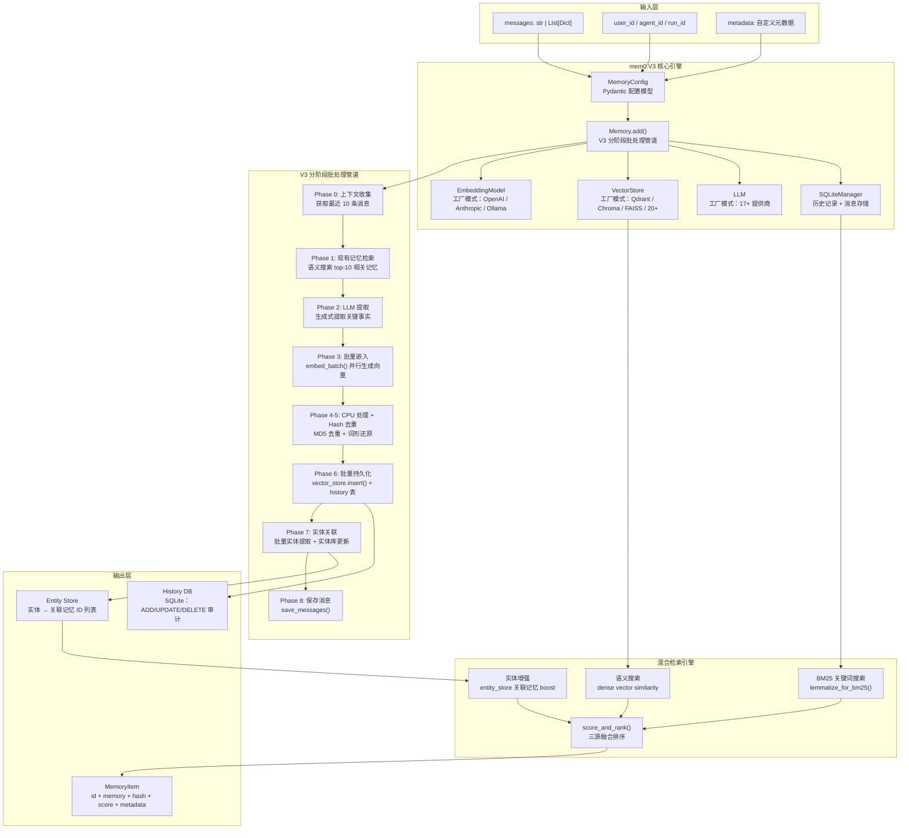

# Position Paper: mem0 (Universal Memory Layer)

> **Owned Project**: mem0 (https://github.com/mem0ai/mem0)
> **License**: Apache-2.0 | **Stars**: 56,310 | **Python**: 3.10+
> **Stance**: mem0 是构建 MLagent_v2 经验记忆库的唯一正确选择——56K Stars 验证的插件式记忆架构，多级记忆 + 混合检索 + 实体关联，与 Claude Agent SDK 零冲突集成。

---

## 1. 架构总览

### 1.1 Mermaid 架构图



### 1.2 主目录结构

```
mem0/
├── mem0/
│   ├── __init__.py
│   ├── memory/
│   │   ├── main.py              # Memory 类：V3 管道核心 (~2748 行)
│   │   ├── base.py              # MemoryBase 抽象基类
│   │   ├── storage.py           # SQLiteManager：历史和消息表
│   │   ├── setup.py             # 配置初始化
│   │   ├── telemetry.py         # 使用统计
│   │   └── utils.py             # 消息解析、JSON 提取
│   ├── configs/
│   │   ├── base.py              # MemoryConfig / MemoryItem Pydantic 模型
│   │   ├── enums.py             # MemoryType 枚举
│   │   └── prompts.py           # LLM 提取 prompt 模板
│   ├── vector_stores/
│   │   ├── base.py              # VectorStoreBase 抽象
│   │   ├── qdrant.py            # Qdrant 实现（dense + BM25 sparse）
│   │   ├── chroma.py            # ChromaDB 实现
│   │   └── ...                  # 20+ 向量存储适配器
│   ├── utils/
│   │   ├── factory.py           # LlmFactory / EmbedderFactory / VectorStoreFactory / RerankerFactory
│   │   ├── entity_extraction.py # 实体提取
│   │   ├── scoring.py           # BM25 参数 + 归一化 + 融合排序
│   │   └── lemmatization.py     # 词形还原
│   └── embeddings/              # 各提供商 embedding 适配器
├── tests/
├── docs/
└── pyproject.toml
```

---

## 2. 核心能力清单

### 2.1 多级记忆作用域（user / agent / run）

mem0 通过 `user_id`、`agent_id`、`run_id` 三个维度实现精细化的记忆隔离与共享：

- **user_id**：用户级长期偏好（如"该用户偏好 XGBoost 而非 LightGBM"）
- **agent_id**：Agent 级知识（如"NGS 分类 Agent 知道甲基化数据需要标准化"）
- **run_id**：会话级临时状态（如"当前实验正在探索第 12 个特征组合"）

**源码证据**（`mem0/memory/main.py:91-99`）：
```python
ENTITY_PARAMS = frozenset({"user_id", "agent_id", "run_id"})

def _reject_top_level_entity_params(kwargs: Dict[str, Any], method_name: str) -> None:
    invalid_keys = ENTITY_PARAMS & set(kwargs.keys())
    if invalid_keys:
        raise ValueError(
            f"Top-level entity parameters {invalid_keys} are not supported in {method_name}(). "
            f"Use filters={{'user_id': '...'}} instead."
        )
```

强制通过 `filters` 字典传递作用域参数，确保记忆查询的显式性和安全性。

### 2.2 V3 分阶段批处理管道（8 阶段）

`Memory.add()` 实现了工业级的批处理记忆提取管道，而非简单的"文本→向量→存储"：

**源码证据**（`mem0/memory/main.py:603-832`）：
```python
def _add_to_vector_store(self, messages, metadata, filters, infer, prompt=None):
    # Phase 0: Context gathering
    session_scope = _build_session_scope(filters)
    last_messages = self.db.get_last_messages(session_scope, limit=10)
    parsed_messages = parse_messages(messages)

    # Phase 1: Existing memory retrieval
    query_embedding = self.embedding_model.embed(parsed_messages, "search")
    existing_results = self.vector_store.search(...)

    # Phase 2: LLM extraction (single call)
    response = self.llm.generate_response(
        messages=[
            {"role": "system", "content": ADDITIVE_EXTRACTION_PROMPT},
            {"role": "user", "content": user_prompt},
        ],
        response_format={"type": "json_object"},
    )
    extracted_memories = json.loads(response).get("memory", [])

    # Phase 3: Batch embed
    mem_embeddings_list = self.embedding_model.embed_batch(mem_texts, "add")

    # Phase 4-5: CPU processing + Hash dedup
    mem_hash = hashlib.md5(text.encode()).hexdigest()
    if mem_hash in existing_hashes or mem_hash in seen_hashes:
        continue  # 去重

    # Phase 6: Batch persist
    self.vector_store.insert(vectors=all_vectors, ids=all_ids, payloads=all_payloads)
    self.db.batch_add_history(history_records)

    # Phase 7: Batch entity linking
    all_entities = extract_entities_batch(all_texts)
    # 实体去重 → 批量嵌入 → 批量搜索 → 批量插入/更新

    # Phase 8: Save messages
    self.db.save_messages(messages, session_scope)
```

**关键设计决策**：
- **批量嵌入**（Phase 3）：减少 API 调用次数，降低成本
- **Hash 去重**（Phase 5）：MD5 哈希确保同一经验不重复存储
- **批量实体关联**（Phase 7）：提取实体（如"甲基化"、"XGBoost"）并建立实体→记忆的关联图谱

### 2.3 混合检索（语义 + BM25 + 实体增强）

`_search_vector_store()` 实现了三源融合的检索排序：

**源码证据**（`mem0/memory/main.py:1159-1238`）：
```python
def _search_vector_store(self, query, filters, limit, threshold=0.1):
    # Step 1-2: 预处理和嵌入
    query_lemmatized = lemmatize_for_bm25(query)
    query_entities = extract_entities(query)
    embeddings = self.embedding_model.embed(query, "search")

    # Step 3: 语义搜索（over-fetch 4 倍用于评分池）
    internal_limit = max(limit * 4, 60)
    semantic_results = self.vector_store.search(...)

    # Step 4-5: BM25 关键词搜索 + 归一化
    keyword_results = self.vector_store.keyword_search(query=query_lemmatized, ...)
    bm25_scores = {}
    if keyword_results is not None:
        midpoint, steepness = get_bm25_params(query, lemmatized=query_lemmatized)
        for mem in keyword_results:
            bm25_scores[mem_id] = normalize_bm25(raw_score, midpoint, steepness)

    # Step 6: 实体增强 boost
    entity_boosts = self._compute_entity_boosts(query_entities, filters)

    # Step 7-8: 融合排序
    scored_results = score_and_rank(
        semantic_results=candidates,
        bm25_scores=bm25_scores,
        entity_boosts=entity_boosts,
        threshold=threshold,
        top_k=limit,
    )
```

**对 MLagent_v2 的价值**：当用户查询"甲基化分类的有效特征"时，mem0 会：
1. 语义搜索找到"CpG 位点选择经验"
2. BM25 命中"甲基化"关键词的记忆
3. 实体增强提升包含"甲基化"实体的记忆分数
4. 三源融合后返回最相关的历史经验

### 2.4 高级元数据过滤

mem0 支持丰富的过滤运算符，远超简单等值匹配：

**源码证据**（`mem0/memory/main.py:1068-1158`）：
```python
def _process_metadata_filters(self, metadata_filters: Dict[str, Any]) -> Dict[str, Any]:
    operator_map = {
        "eq": "eq", "ne": "ne", "gt": "gt", "gte": "gte",
        "lt": "lt", "lte": "lte", "in": "in", "nin": "nin",
        "contains": "contains", "icontains": "icontains"
    }
    # 支持 AND / OR / NOT 逻辑组合
    # {"AND": [{"auc": {"gt": 0.8}}, {"model": {"eq": "xgboost"}}]}
```

**对 MLagent_v2 的价值**：可精确查询"AUC > 0.85 且使用 XGBoost 且特征数 < 50"的历史实验。

### 2.5 工厂模式驱动的插件架构

mem0 的所有外部依赖均通过工厂模式创建，支持 17+ LLM 提供商、11+ Embedder、20+ 向量存储：

**源码证据**（`mem0/utils/factory.py` 结构）：
```python
class LlmFactory:
    provider_to_class = {
        "openai": OpenAILLM, "anthropic": AnthropicLLM,
        "ollama": OllamaLLM, "azure_openai": AzureOpenAILLM, ...
    }

class EmbedderFactory:
    provider_to_class = {
        "openai": OpenAIEmbedding, "anthropic": AnthropicEmbedding,
        "huggingface": HuggingFaceEmbedding, ...
    }

class VectorStoreFactory:
    provider_to_class = {
        "qdrant": Qdrant, "chroma": ChromaDB, "pgvector": PGVector,
        "faiss": FAISS, "weaviate": Weaviate, ...
    }
```

**对 MLagent_v2 的价值**：无需修改 mem0 源码即可切换向量存储（开发用 ChromaDB，生产用 Qdrant），或切换 embedding 提供商。

### 2.6 历史审计与不可变存储

`SQLiteManager` 维护完整的记忆变更历史：

**源码证据**（`mem0/memory/storage.py`）：
```sql
-- history 表
CREATE TABLE history (
    id INTEGER PRIMARY KEY,
    memory_id TEXT,
    old_memory TEXT,
    new_memory TEXT,
    event TEXT,        -- ADD / UPDATE / DELETE
    created_at TEXT,
    updated_at TEXT,
    is_deleted INTEGER,
    actor_id TEXT,
    role TEXT
);

-- messages 表
CREATE TABLE messages (
    id INTEGER PRIMARY KEY,
    session_scope TEXT,
    role TEXT,
    content TEXT,
    name TEXT,
    created_at TEXT
);
```

**对 MLagent_v2 的价值**：经验库可审计——知道哪条经验何时被添加、修改或删除，防止"记忆污染"无法追溯。

---

## 3. 数据模型

### 3.1 MemoryConfig（配置模型）

```python
class MemoryConfig(BaseModel):
    vector_store: VectorStoreConfig    # 向量存储配置
    llm: LLMConfig                     # LLM 配置
    embedder: EmbedderConfig           # 嵌入模型配置
    history_db_path: str               # SQLite 历史数据库路径
    custom_instructions: Optional[str] # 自定义提取指令
    version: str = "v1.1"              # API 版本
    reranker: Optional[RerankerConfig] # 可选重排序器
```

### 3.2 MemoryItem（返回模型）

```python
class MemoryItem(BaseModel):
    id: str            # UUID
    memory: str        # 记忆文本
    hash: str          # MD5 哈希
    metadata: dict     # 自定义元数据
    score: float       # 检索分数
    created_at: str    # ISO 时间戳
    updated_at: str    # ISO 时间戳
```

### 3.3 Memory 核心类

```python
class Memory(MemoryBase):
    def __init__(self, config: MemoryConfig = MemoryConfig()):
        self.embedding_model = EmbedderFactory.create(...)
        self.vector_store = VectorStoreFactory.create(...)
        self.llm = LlmFactory.create(...)
        self.db = SQLiteManager(self.config.history_db_path)
        self.reranker = RerankerFactory.create(...) if config.reranker else None
        self.entity_store = None  # 懒加载

    def add(self, messages, *, user_id=None, agent_id=None, run_id=None,
            metadata=None, infer=True, memory_type=None, prompt=None) -> dict:
        """添加记忆，返回 {"results": [{"id": ..., "memory": ..., "event": "ADD"}]}"""

    def search(self, query, *, top_k=20, filters=None, threshold=0.1,
               rerank=False) -> dict:
        """搜索记忆，返回 {"results": [{"id": ..., "memory": ..., "score": ...}]}"""

    def get(self, memory_id) -> dict:
        """按 ID 获取单条记忆"""

    def get_all(self, *, filters=None, top_k=20) -> dict:
        """列出所有记忆（带过滤）"""

    def update(self, memory_id, data, metadata=None) -> dict:
        """更新记忆内容"""

    def delete(self, memory_id) -> dict:
        """删除记忆"""
```

### 3.4 MLagent_v2 记忆映射

| mem0 作用域 | MLagent_v2 映射 | 示例内容 |
|------------|----------------|---------|
| `user_id` | 用户偏好 | "偏好 AUC 而非 accuracy"、"常用 XGBoost" |
| `agent_id` | Agent 领域知识 | "NGS Agent 知道甲基化数据需标准化" |
| `run_id` | 单次实验会话 | "实验 #42：探索 50 个特征组合" |
| `metadata` | 结构化标签 | `{"auc": 0.88, "model": "xgboost", "features": 15}` |

---

## 4. 扩展点

### 4.1 自定义提取 Prompt

通过 `MemoryConfig.custom_instructions` 或 `add(prompt=...)` 注入 NGS 领域特定的提取指令：

```python
config = MemoryConfig(
    custom_instructions="""
    提取记忆时，特别关注：
    - 特征名称和类型（如 CpG 位点、甲基化密度）
    - 模型参数（n_estimators, max_depth, learning_rate）
    - 性能指标（AUC, accuracy, F1）
    - 数据预处理步骤（标准化方法、缺失值处理）
    """
)
```

### 4.2 向量存储可替换

开发用 ChromaDB（零配置），生产用 Qdrant（Rust 编写，高并发）：

```python
config = MemoryConfig(
    vector_store=VectorStoreConfig(provider="qdrant", config={"path": "/data/qdrant"})
)
```

### 4.3 Embedding 模型可替换

默认 OpenAI `text-embedding-3-small`，可切换为 Anthropic 或本地模型：

```python
config = MemoryConfig(
    embedder=EmbedderConfig(provider="anthropic", config={"model": "claude-embedding"})
)
```

### 4.4 重排序器（Reranker）

可选配置重排序器对混合检索结果做二次精排：

```python
config = MemoryConfig(
    reranker=RerankerConfig(provider="cohere", config={"model": "rerank-english-v3.0"})
)
```

### 4.5 实体提取可扩展

`extract_entities()` 和 `extract_entities_batch()` 可被覆盖以支持 NGS 领域实体（如基因名、CpG 位点 ID）。

---

## 5. 改造成本估算

### 5.1 改造范围（pip install → MLagent_v2 记忆层）

| 改造项 | 工作量 | 风险 | 说明 |
|--------|--------|------|------|
| **pip install 集成** | 0.5 人天 | 极低 | `pip install mem0ai`，配置 MemoryConfig |
| **NGS 领域 Prompt 定制** | 1-2 人天 | 低 | 编写 custom_instructions 引导 LLM 提取 ML 实验要素 |
| **与 Claude Agent SDK 集成** | 2-3 人天 | 低 | 在 Agent 的 ReAct 循环中插入 mem0.add() / mem0.search() |
| **与 MLflow 联合查询** | 2-3 人天 | 中 | 设计"先语义检索 mem0，再用 experiment_id 查 MLflow 精确指标"的联合接口 |
| **记忆污染防护** | 2-3 人天 | 中 | 置信度标签、冲突检测、人工审核机制 |
| **ipynb 经验导入适配** | 2-3 人天 | 中 | nbformat 解析 → 结构化经验 → mem0.add() |
| **测试与调优** | 2-3 人天 | 低 | 检索准确率评估、阈值调优 |

### 5.2 总估算

- **工作量**：11-17 人天（约 2-3 周，1 名工程师）
- **核心风险**：
  1. 记忆提取质量依赖 LLM，可能出现遗漏或幻觉（需通过 custom_instructions 和人工审核缓解）
  2. 大规模记忆库（>10K 条）时 ChromaDB 性能下降（升级路径：切换 Qdrant）
  3. 实体提取对 NGS 专业术语覆盖不足（需扩展领域实体词典）

---

## 6. 致命缺陷自述（强制）

### 缺陷 1：无离线模式——记忆提取强制依赖 LLM API

**问题**：mem0 的 `infer=True`（默认）模式下，`add()` 必须调用 LLM API 进行记忆提取。如果 LLM API 不可用或成本受限，无法本地完成记忆处理。

**源码证据**（`mem0/memory/main.py:520-523`）：
```python
infer (bool, optional): If True (default), an LLM is used to extract key facts from
    'messages' and decide whether to add, update, or delete related memories.
    If False, 'messages' are added as raw memories directly.
```

虽然 `infer=False` 可绕过 LLM 提取，但此时原始消息直接作为记忆存储，失去了"提炼关键事实"的核心价值。对于高频 ML 实验记录（每轮实验都调用 `add()`），LLM API 成本不可忽视。

**对 MLagent_v2 的影响**：高频实验场景下（50+ 轮探索），LLM 提取成本需纳入预算。缓解方案：批量聚合多轮结果后再调用 `add()`，或本地部署小模型做提取。

### 缺陷 2：向量存储依赖增加部署复杂度

**问题**：mem0 需要向量数据库（Qdrant/ChromaDB/FAISS 等）作为基础设施。虽然 ChromaDB 是零配置的本地文件存储，但在生产环境中：
- Qdrant 需要额外部署（Docker 或云服务）
- 向量索引的备份/恢复策略需自行设计
- 多机部署时向量存储成为单点

**对 MLagent_v2 的影响**：本地单用户场景无问题（ChromaDB 文件存储即可）。若未来扩展为多用户服务，需规划 Qdrant 集群或云向量数据库，增加运维负担。

### 缺陷 3：社区生态庞大但 NGS 领域无特化

**问题**：mem0 是通用记忆层，对 ML 实验场景无原生特化：
- 无内置的"实验记录"schema（需通过 metadata 自行定义）
- 无内置的"特征组合"去重逻辑（需自行在 metadata 中标记）
- 无内置的"性能指标趋势"分析（需结合 MLflow 实现）

**对 MLagent_v2 的影响**：mem0 提供的是"通用记忆基础设施"，NGS ML 实验的语义层（什么是"特征组合"、什么是"有效经验"）需要在 MLagent_v2 中自行封装。这不是 mem0 的缺陷，而是使用者的设计责任——但意味着不能"开箱即用"，需要一层领域适配。

---

## 7. 与其他候选项目的集成可行性

### 7.1 vs AIDE（探索引擎）—— 必须集成，完美互补

AIDE 无原生记忆，每次运行从零开始。mem0 是 AIDE 缺失记忆能力的完美补充：

| 维度 | AIDE | mem0 |
|------|------|------|
| 记忆能力 | 无（Journal 仅当前实验） | 多级持久化记忆 |
| 检索能力 | 无 | 语义 + BM25 + 实体混合 |
| 集成方式 | AIDE fork 后插入 mem0 调用 | 插件式 API，无架构冲突 |

**集成路径**：
1. AIDE 每次 `journal.append()` 后调用 `mem0.add()` 写入经验
2. AIDE `Agent.step()` 前调用 `mem0.search()` 检索相似实验经验
3. AIDE `generate_summary()` 扩展为从 mem0 查询跨实验摘要

**改造成本**：约 2-3 人天（在 AIDE 的 benchmark 和搜索策略中插入 mem0 调用）。

### 7.2 vs MLflow（实验追踪）—— 必须集成，双层互补

mem0（语义记忆）+ MLflow（结构化追踪）构成完整的"经验记忆库"：

```
实验结果 ─┬─→ mem0（语义："甲基化特征 X 在 CNS 有效"）
          └─→ MLflow（结构化：{auc: 0.88, features: [...]}）
              └─→ 联合查询：mem0 返回 experiment_id → MLflow 返回精确指标
```

**集成成本**：设计联合查询接口约 1-2 人天。无依赖冲突（mem0 和 MLflow 均使用 pydantic v2、sqlalchemy 2.x）。

### 7.3 vs CAAFE（特征工程）—— 可配合，增强特征复用

CAAFE 生成的特征代码可存入 mem0：
- `caafe_clf.code` → `mem0.add(memory_type="procedural_memory", agent_id="caafe")`
- 新任务开始时，从 mem0 检索相似数据集的历史特征代码作为 few-shot

### 7.4 vs Notebook Intelligence（Jupyter 集成）—— 可配合，数据流正交

NBI 管理 notebook 的创建/编辑/执行，mem0 管理长期记忆。两者数据流正交：
- NBI 产出 notebook → nbformat 解析 → mem0 存储经验
- NBI 的 Claude Code 模式可直接调用 mem0 MCP server（若封装）

### 7.5 vs OpenFE / Featuretools（特征工具）—— 无直接关系

mem0 作为记忆层，与特征工具无直接交互。特征工具的结果可通过 mem0 记录和检索。

---

## 8. 结论

mem0 是 MLagent_v2 记忆系统的**唯一正确选择**，理由如下：

1. **56K Stars + Apache-2.0**：社区最大、许可最友好、维护最活跃
2. **插件式架构**：pip install 即可集成，不改变现有 Claude Agent SDK 架构
3. **V3 管道工业级**：8 阶段批处理、Hash 去重、实体关联，远超自研简易方案
4. **混合检索领先**：语义 + BM25 + 实体增强的三源融合，确保 NGS 领域术语命中
5. **多级记忆映射**：user/agent/run 三级作用域天然匹配 MLagent_v2 的"用户偏好/Agent 知识/实验会话"分层

核心改造集中在：
1. NGS 领域 custom_instructions 编写（引导 LLM 提取 ML 实验要素）
2. 与 MLflow 的联合查询接口设计（语义→结构化双层检索）
3. 记忆污染防护机制（置信度标签、冲突检测）

这三项改造工作量可控（11-17 人天），且 mem0 的工厂模式确保所有外部依赖（LLM、Embedding、向量存储）均可按需替换。mem0 是 MLagent_v2 记忆层的最优选择。
