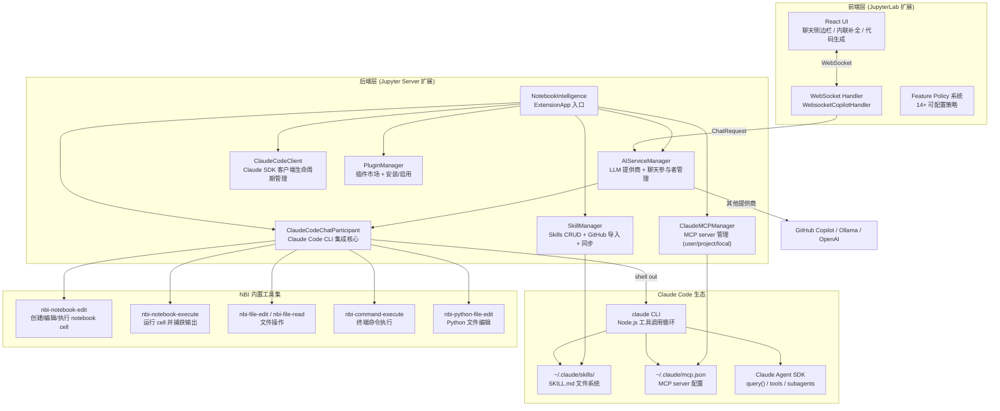

# Position Paper: Notebook Intelligence (NBI)

> **Owned Project**: Notebook Intelligence (https://github.com/notebook-intelligence/notebook-intelligence)
> **License**: GPL-3.0 | **Stars**: 301 | **Python**: 3.10+
> **Stance**: Notebook Intelligence 是 MLagent_v2 交互训练层的最优参考实现——直接集成 Claude Code CLI 作为聊天后端，在 JupyterLab 中复用 Claude 的 tools/skills/MCP 全套能力，是已知最接近目标 harness 架构的集成先例。

---

## 1. 架构总览

### 1.1 Mermaid 架构图



### 1.2 主目录结构

```
notebook-intelligence/
├── notebook_intelligence/
│   ├── extension.py              # NotebookIntelligence ExtensionApp (~2854 行)
│   ├── api.py                    # 核心抽象：ChatRequest, ChatResponse, Tool, Toolset, MCPServer
│   ├── claude.py                 # ClaudeCodeClient + ClaudeCodeChatParticipant
│   ├── claude_mcp_manager.py     # ClaudeMCPManager：读写 claude mcp.json
│   ├── claude_sessions.py        # Claude Code session 管理
│   ├── skillset.py               # Skill 数据类 + YAML frontmatter 解析
│   ├── ai_service_manager.py     # AIServiceManager：LLM 提供商路由
│   ├── feature_flags.py          # 特性开关与策略解析
│   ├── built_in_toolsets.py      # 内置工具集定义
│   ├── cell_output.py            # Cell 输出捕获与格式化
│   ├── context_factory.py        # RuleContext 工厂
│   ├── tour_config.py            # 首次运行引导配置
│   ├── util.py                   # 工具函数集合
│   └── github_copilot.py         # GitHub Copilot 集成
├── src/                          # TypeScript/React 前端
│   ├── api.ts                    # 前端 API 类型
│   └── components/               # React 组件
├── package.json                  # JupyterLab 扩展包配置
├── pyproject.toml
└── README.md
```

---

## 2. 核心能力清单

### 2.1 Claude Code CLI 直接集成

NBI 的核心创新是**将 Claude Code CLI 作为聊天后端**，在 JupyterLab 中完整复用 Claude 的 tool use、skills 和 MCP 能力：

**源码证据**（`notebook_intelligence/extension.py:1470-1560`）：
```python
class ClaudeSessionsResumeHandler(APIHandler):
    """Reconnects the Claude client so the next query resumes a session."""
    def post(self):
        session_id = body.get("session_id")
        default_chat_participant = ai_service_manager.default_chat_participant
        if not isinstance(default_chat_participant, ClaudeCodeChatParticipant):
            self.set_status(404)
            self.finish(json.dumps({"error": "Claude Code mode is not enabled"}))
            return
        default_chat_participant.resume_session(session_id)
```

**关键设计**：NBI 不是重新实现 Claude 的 agent 循环，而是**复用** `claude` CLI 的已有能力：
- Tool use 循环由 `claude` CLI 处理
- Skills 匹配由 Claude SDK 处理
- MCP server 调用由 Claude SDK 处理
- NBI 只负责：启动 CLI 进程、传递用户输入、接收输出、渲染到 UI

**对 MLagent_v2 的价值**：验证了"Claude Code CLI 作为 harness"架构的可行性——NBI 已经跑通了这条路径，MLagent_v2 可直接借鉴其集成模式。

### 2.2 Feature Policy 系统（14+ 可配置策略）

NBI 提供企业级的功能策略系统，每个策略可通过环境变量或 traitlet 配置：

**源码证据**（`notebook_intelligence/extension.py:239-294`）：
```python
FEATURE_POLICY_SPEC = (
    ("explain_error", "NBI_EXPLAIN_ERROR_POLICY", "explain_error_policy"),
    ("output_followup", "NBI_OUTPUT_FOLLOWUP_POLICY", "output_followup_policy"),
    ("claude_mode", "NBI_CLAUDE_MODE_POLICY", "claude_mode_policy"),
    ("claude_code_tools", "NBI_CLAUDE_CODE_TOOLS_POLICY", "claude_code_tools_policy"),
    ("claude_jupyter_ui_tools", "NBI_CLAUDE_JUPYTER_UI_TOOLS_POLICY", "claude_jupyter_ui_tools_policy"),
    ("skills_management", "NBI_SKILLS_MANAGEMENT_POLICY", "skills_management_policy"),
    ("claude_mcp_management", "NBI_CLAUDE_MCP_MANAGEMENT_POLICY", "claude_mcp_management_policy"),
    ("claude_plugins_management", "NBI_CLAUDE_PLUGINS_MANAGEMENT_POLICY", "claude_plugins_management_policy"),
    ...
)
```

每个策略支持三种模式：
- `user-choice`：用户可自行开关
- `force-on`：强制启用，用户不可关闭
- `force-off`：强制禁用，返回 403

**对 MLagent_v2 的价值**：可直接复用这套策略系统设计，为 NGS 训练场景定义自定义策略（如"禁止删除数据目录"、`force-off` 危险工具）。

### 2.3 Skills 管理系统

NBI 提供完整的 Skills CRUD + GitHub 导入 + 自动同步：

**源码证据**（`notebook_intelligence/extension.py:1046-1350`）：
```python
class SkillsBaseHandler(PolicyGatedHandler):
    """Shared helpers for skills endpoints."""
    allow_github_skill_import = True
    skills_management_enabled = True
    policy_enabled_attr = "skills_management_enabled"

class SkillsListHandler(SkillsBaseHandler):
    def get(self):
        skills = [s.to_dict(include_files=False) for s in self.skill_manager.list_skills()]
        self.finish(json.dumps({"skills": skills}))

    def post(self):
        skill = self.skill_manager.create_skill(
            scope=data["scope"],      # "user" or "project"
            name=data["name"],
            description=data.get("description", ""),
            allowed_tools=data.get("allowed_tools", []),
            body=data.get("body", ""),
        )

class SkillDetailHandler(SkillsBaseHandler):
    def get(self, scope, name):
        skill = self.skill_manager.get_skill(scope, name)
        self.finish(json.dumps({"skill": skill.to_dict(include_body=True)}))

    def put(self, scope, name):
        skill = self.skill_manager.update_skill(
            scope=scope, name=name,
            description=data.get("description"),
            allowed_tools=data.get("allowed_tools"),
            body=data.get("body"),
        )

    def delete(self, scope, name):
        self.skill_manager.delete_skill(scope, name)

class SkillsImportHandler(SkillsBaseHandler):
    def post(self):
        skill = self.skill_manager.import_from_github(
            url=url, scope=scope,
            name_override=data.get("name"),
            overwrite=bool(data.get("overwrite", False)),
        )
```

**对 MLagent_v2 的价值**：
- Skills 的 user/project 两级作用域可直接映射到 MLagent_v2 的"个人技能/项目技能"
- GitHub 导入机制可复用为"社区 Skill 市场"
- 自动同步（`tracks_upstream`）确保 Skill 始终与上游仓库保持一致

### 2.4 MCP Server 管理

NBI 的 `ClaudeMCPManager` 封装了对 Claude Code MCP 配置的读写：

**源码证据**（`notebook_intelligence/extension.py:843-931`）：
```python
class ClaudeMCPBaseHandler(PolicyGatedHandler):
    """Shared helpers + policy gate for Claude-MCP endpoints."""
    claude_mcp_management_enabled = True
    policy_enabled_attr = "claude_mcp_management_enabled"

    @property
    def manager(self) -> "ClaudeMCPManager":
        return ClaudeMCPManager(working_dir=get_jupyter_root_dir() or None)

class ClaudeMCPListHandler(ClaudeMCPBaseHandler):
    def get(self):
        servers = [s.to_dict() for s in self.manager.list_servers()]
        self.finish(json.dumps({"servers": servers}))

    async def post(self):
        srv = await self.manager.add_server(
            name=data.get("name", ""),
            scope=data.get("scope", "user"),       # user / project / local
            transport=data.get("transport", "stdio"),
            command_or_url=data.get("command_or_url", ""),
            args=data.get("args"),
            env=data.get("env"),
            headers=data.get("headers"),
        )

class ClaudeMCPDetailHandler(ClaudeMCPBaseHandler):
    def get(self, scope, name):
        srv = self.manager.get_server(name, scope)
        self.finish(json.dumps({"server": srv.to_dict()}))

    async def delete(self, scope, name):
        await self.manager.remove_server(name, scope)
```

**对 MLagent_v2 的价值**：
- MCP server 的 user/project/local 三级作用域与 MLagent_v2 的配置分层一致
- `add_server` / `remove_server` 的 API 可直接复用为 MLagent_v2 的 MCP 管理界面
- 支持 stdio 和 Streamable HTTP 两种传输方式

### 2.5 内置工具集（Notebook 操作）

NBI 提供 6 个内置工具，覆盖 notebook 和文件操作：

**源码证据**（`notebook_intelligence/extension.py:2266-2270`）：
```python
disabled_tools = List(
    trait=Unicode(),
    default_value=None,
    help="""
    List of built-in tools to disable. Valid tool names:
    nbi-notebook-edit, nbi-notebook-execute, nbi-python-file-edit,
    nbi-file-edit, nbi-file-read, nbi-command-execute.
    """,
)
```

| 工具 | 功能 |
|------|------|
| `nbi-notebook-edit` | 创建/编辑 notebook cell |
| `nbi-notebook-execute` | 执行 cell 并捕获输出 |
| `nbi-python-file-edit` | 编辑 Python 文件 |
| `nbi-file-edit` | 编辑任意文件 |
| `nbi-file-read` | 读取文件内容 |
| `nbi-command-execute` | 执行终端命令 |

**对 MLagent_v2 的价值**：这些工具是"交互训练"模式的基础——Agent 可以自主创建 notebook、写入训练代码、执行并读取结果。

### 2.6 多 LLM 提供商支持

NBI 不仅支持 Claude Code，还支持 GitHub Copilot、Ollama、OpenAI 兼容端点：

**源码证据**（`notebook_intelligence/extension.py:2247-2254`）：
```python
disabled_providers = List(
    trait=Unicode(),
    default_value=None,
    help="""
    List of LLM providers to disable. Valid provider IDs:
    github-copilot, openai-compatible, litellm-compatible, ollama.
    """,
)
```

**对 MLagent_v2 的价值**：虽然主路径是 Claude，但保留 Ollama 本地模型作为降级方案是有价值的。

---

## 3. 数据模型

### 3.1 ChatRequest（聊天请求）

```python
@dataclass
class ChatRequest:
    chat_mode: ChatMode           # "ask" / "agent" / "inline-chat"
    tool_selection: RequestToolSelection  # 启用的工具集
    prompt: str                   # 用户输入
    chat_history: list[dict]      # 历史消息
    cancel_token: CancelToken     # 取消令牌
    rule_context: RuleContext     # 规则上下文
```

### 3.2 ChatResponse（聊天响应）

```python
class ChatResponse:
    def stream(self, data: ResponseStreamData):
        """流式输出：Markdown / Image / HTMLFrame / Anchor / Button / Progress / Confirmation"""

    def finish(self):
        """结束响应流"""

    async def run_ui_command(self, command: str, args: dict = {}) -> None:
        """触发 UI 命令（如滚动到某 cell）"""
```

### 3.3 Skill（技能）

**源码证据**（`notebook_intelligence/skillset.py`）：
```python
SKILL_NAME_REGEX = r"[a-z0-9][a-z0-9-]{0,63}"

@dataclass
class Skill:
    name: str
    description: str
    version: str
    author: str
    allowed_tools: list[str]
    body: str              # Markdown 内容
    scope: str             # "user" or "project"
```

### 3.4 Feature Policy（特性策略）

```python
# 策略解析结果
{
    "claude_mode": {"enabled": True, "locked": False},
    "skills_management": {"enabled": True, "locked": False},
    "claude_mcp_management": {"enabled": True, "locked": True},  # 管理员锁定
}
```

### 3.5 MLagent_v2 映射

| NBI 概念 | MLagent_v2 映射 | 说明 |
|---------|----------------|------|
| `ClaudeCodeChatParticipant` | Agent 执行层 | 复用 Claude Code CLI 作为 harness |
| `Skill` | SKILL.md | 完全兼容 Claude Skills 格式 |
| `ClaudeMCPManager` | MCP 配置管理 | `.claude/mcp.json` 读写封装 |
| `Feature Policy` | 安全策略层 | 工具启用/禁用、权限控制 |
| `nbi-notebook-*` 工具 | 交互训练工具 | Agent 操作 notebook 的基础 |
| `ChatRequest.chat_mode` | 交互模式 | "ask"=问答, "agent"=自主执行 |

---

## 4. 扩展点

### 4.1 自定义工具集

通过 `built_in_toolsets.py` 模式添加 NGS 特化工具：

```python
# 新增 NGS 工具
class NGSTools(Toolset):
    id = "ngs-tools"
    name = "NGS Analysis Tools"
    tools = [
        Tool("read-bam", "读取 BAM 文件", ...),
        Tool("extract-methylation", "提取甲基化特征", ...),
        Tool("run-deseq2", "差异表达分析", ...),
    ]
```

### 4.2 自定义 Feature Policy

添加 NGS 场景特有的策略：

```python
# 新增策略
("ngs_data_protection", "NBI_NGS_DATA_PROTECTION_POLICY", "ngs_data_protection_policy")
```

### 4.3 Skill 模板扩展

NBI 的 Skill 格式与 Claude Code 原生兼容，可直接添加 NGS 领域 Skill：

```markdown
---
name: ngs-methylation-prep
description: NGS 甲基化数据预处理流程
version: 1.0.0
author: MLagent
---

# NGS 甲基化数据预处理

## 步骤
1. 读取 BAM 文件（pysam）
2. 提取 CpG 位点覆盖度
3. 批次效应校正（ComBat）
4. 标准化（beta 值转换）
```

### 4.4 MCP Server 扩展

通过 `ClaudeMCPManager` 动态添加 MCP server：

```python
await manager.add_server(
    name="mlflow-mcp",
    scope="project",
    transport="stdio",
    command_or_url="python",
    args=["-m", "mlflow.mcp.server"],
)
```

### 4.5 前端组件定制

NBI 前端基于 React + TypeScript，可定制：
- 实验监控面板（新增 AUC 曲线组件）
- 记忆库浏览器（集成 mem0 查询结果）
- Skill 编辑器（YAML frontmatter 可视化编辑）

---

## 5. 改造成本估算

### 5.1 改造范围（fork / 复用 → MLagent_v2 交互训练层）

| 改造项 | 工作量 | 风险 | 说明 |
|--------|--------|------|------|
| **代码研读与架构理解** | 2-3 人天 | 低 | NBI 代码量较大（~3000 行 extension.py），需理解其集成模式 |
| **提取 Claude Code 集成逻辑** | 3-5 人天 | 中 | 提取 `ClaudeCodeClient` + `ClaudeCodeChatParticipant` 核心逻辑 |
| **剥离 JupyterLab 依赖** | 3-5 人天 | 中 | NBI 是 JupyterLab 扩展，MLagent_v2 用 Streamlit。需剥离前端或重写适配层 |
| **Skill 管理复用** | 2-3 人天 | 低 | `SkillManager` 相对独立，可提取为通用模块 |
| **MCP 管理复用** | 2-3 人天 | 低 | `ClaudeMCPManager` 可复用为 MLagent_v2 的 MCP 配置界面 |
| **Feature Policy 复用** | 2-3 人天 | 低 | 策略系统设计通用，需适配 Streamlit 前端 |
| **NGS 工具集扩展** | 3-5 人天 | 中 | 添加 NGS 特化工具（BAM 读取、甲基化提取等） |
| **测试与验证** | 2-3 人天 | 低 | 端到端交互训练流程验证 |

### 5.2 总估算

- **工作量**：19-30 人天（约 3-5 周，1 名工程师）
- **核心风险**：
  1. JupyterLab 扩展架构与 Streamlit 不匹配，剥离成本高
  2. GPL-3.0 许可：内部使用不触发 copyleft，但需确保不对外分发修改后的代码
  3. NBI 社区小（301 Stars），长期维护存疑，不能依赖上游更新

---

## 6. 致命缺陷自述（强制）

### 缺陷 1：GPL-3.0 许可——copyleft 传染风险

**问题**：NBI 采用 GPL-3.0 许可。如果 MLagent_v2 复用 NBI 代码并对外分发（如开源发布或 SaaS 服务），则整个项目必须也采用 GPL-3.0，这会传染到 mem0（Apache-2.0）和 MLflow（Apache-2.0）的集成代码。

**源码证据**：`LICENSE` 文件明确标注 GPL-3.0。

**对 MLagent_v2 的影响**：
- **内部使用场景**：产品为内部使用，不对外分发，copyleft 不触发，**可直接复用代码**
- **未来开源风险**：若计划开源 MLagent_v2，需将 NBI 相关代码隔离为独立 GPL 模块，或通过 IPC 通信避免代码链接
- **缓解方案**：仅参考 NBI 的设计模式（Claude Code 集成方式），自研实现核心逻辑，避免直接复用 GPL 代码

### 缺陷 2：强耦合 JupyterLab 扩展架构

**问题**：NBI 是完整的 JupyterLab 扩展，其架构深度耦合：
- 前端：React + TypeScript + JupyterLab 组件系统
- 后端：Jupyter Server 扩展 + Tornado WebSocket
- 构建链：Node.js + npm + JupyterLab 构建系统

**源码证据**（`notebook_intelligence/extension.py:2237-2245`）：
```python
class NotebookIntelligence(ExtensionApp):
    name = "notebook_intelligence"
    default_url = "/notebook-intelligence"
    load_other_extensions = True
    file_url_prefix = "/render"
    static_paths = []
    template_paths = []
```

**对 MLagent_v2 的影响**：MLagent_v2 选择 Streamlit 作为主 UI，与 JupyterLab 扩展架构完全不匹配。提取 NBI 的核心逻辑（Claude Code 集成、Skills 管理、MCP 管理）需要大量解耦工作，而非简单 fork。

### 缺陷 3：社区极小——301 Stars，维护可持续性存疑

**问题**：
- **Stars 仅 301**：对比 mem0（56K）、MLflow（26K），社区关注度极低
- **主要维护者单一**：项目由 Mehmet Bektas 个人主导
- **issue/PR 响应慢**：小项目常见的问题
- **文档不完善**：相比 mem0 和 MLflow 的详尽文档，NBI 文档较简略

**对 MLagent_v2 的影响**：
- 不能依赖上游维护，所有 bug 修复和功能扩展需自行处理
- 遇到边缘情况（如 Claude Code CLI 版本变更导致的兼容性问题）无社区参考
- 建议将 NBI 作为"设计参考"而非"长期依赖"，核心集成逻辑应自研

---

## 7. 与其他候选项目的集成可行性

### 7.1 vs mem0（记忆系统）—— 可配合，数据流正交

NBI 管理 notebook 的创建/编辑/执行，mem0 管理长期记忆。两者数据流正交：

```
NBI 执行 notebook → 训练结果
    ↓
nbformat 解析 → 结构化经验
    ↓
mem0.add() → 语义记忆存储
```

NBI 的 Claude Code 模式可通过 MCP server 调用 mem0（若封装 mem0 为 MCP server）。

### 7.2 vs MLflow（实验追踪）—— 可配合，记录 notebook 执行

NBI 执行 notebook cell 时，训练脚本内的 `mlflow.autolog()` 自动记录实验：
- NBI 的 `nbi-notebook-execute` 工具触发 cell 执行
- 执行过程中 MLflow 记录参数和指标
- NBI 可通过 tag 将 notebook 文件名与 MLflow Run 关联

### 7.3 vs AIDE（探索引擎）—— 可配合，不同入口

AIDE 是独立的探索引擎（CLI/Python API），NBI 是 JupyterLab 内的交互界面。两者可共存：
- AIDE 负责"无人值守自主探索"（后台运行）
- NBI 负责"交互式训练"（用户在 JupyterLab 中发指令）
- 两者共享 mem0 + MLflow 记忆层

### 7.4 vs CAAFE（特征工程）—— 可配合，工具调用关系

CAAFE 可作为 NBI 的 Claude Code 可调用的工具。NBI 的 `nbi-command-execute` 工具可运行 CAAFE 脚本。

### 7.5 vs OpenFE / Featuretools（特征工具）—— 无直接关系

特征工具在 NBI 中通过 `nbi-command-execute` 或 Python cell 执行调用，无直接代码级集成。

---

## 8. 结论

Notebook Intelligence 是 MLagent_v2 交互训练层的**最优参考实现**，但需谨慎对待其复用方式：

1. **Claude Code 集成先例**：NBI 是已知唯一开源的"Claude Code CLI + JupyterLab"集成实现，验证了技术路径的可行性
2. **Skills 管理设计**：user/project 两级作用域、GitHub 导入、自动同步的设计可直接借鉴
3. **MCP 管理封装**：`ClaudeMCPManager` 对 `.claude/mcp.json` 的读写封装是优质参考
4. **Feature Policy 系统**：14+ 可配置策略的企业级设计值得借鉴
5. **GPL-3.0 风险可控**：内部使用不触发 copyleft，但未来若开源需隔离处理

**推荐复用策略**：

```
┌─────────────────────────────────────────────────────────┐
│  推荐路径："研读设计 + 自研核心"而非"直接 fork 集成"       │
├─────────────────────────────────────────────────────────┤
│  自研实现：                                              │
│  · Streamlit 前端中的 Claude Code 交互界面               │
│  · SKILL.md 的 user/project 两级管理                     │
│  · MCP server 的增删改查界面                             │
│  · 安全策略系统（参考 NBI 的 Feature Policy）            │
├─────────────────────────────────────────────────────────┤
│  直接复用（内部使用，GPL 不触发）：                       │
│  · ClaudeMCPManager 的 mcp.json 读写逻辑（如需要）       │
│  · SkillManager 的文件系统操作逻辑（如需要）              │
└─────────────────────────────────────────────────────────┘
```

核心工作量在于将 NBI 的 JupyterLab 集成模式"翻译"为 Streamlit + CLI 双入口架构。预计自研实现（参考 NBI 设计）的工作量与剥离 NBI JupyterLab 依赖的工作量相当，但避免了 GPL 传染风险。Notebook Intelligence 是 MLagent_v2 交互训练层的最优设计参考。
