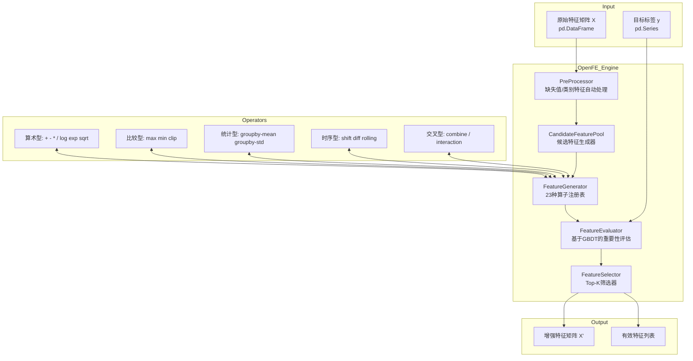

# Position Paper: OpenFE

## Candidate Metadata

| Field | Value |
|---|---|
| Repository | https://github.com/IIIS-Li-Group/OpenFE |
| License | MIT |
| Stars | 870 |
| Language | Python |
| Last Commit | 2024-05-27 |
| Core Value | Automated Feature Generation — 23 built-in operators for classification/regression with automatic handling of missing values and categorical features |

---

## 1. 架构总览

### 1.1 Mermaid 架构图



### 1.2 主目录结构（推断）

```
OpenFE/
├── openfe/
│   ├── __init__.py
│   ├── openfe.py              # 主入口: OpenFE 类
│   ├── feature_generator.py   # 23 种算子的生成逻辑
│   ├── feature_evaluator.py   # 基于 GBDT 的特征重要性评估
│   ├── feature_selector.py    # Top-K 筛选策略
│   ├── candidate_features.py  # 候选特征池管理
│   ├── preprocessing.py       # 缺失值/类别特征自动处理
│   ├── utils.py               # 辅助函数
│   └── tests/
├── examples/                  # 使用示例
├── docs/
└── setup.py / pyproject.toml
```

---

## 2. 核心能力清单

| 能力 | 说明 | 对 MLagent_v2 的价值 |
|---|---|---|
| 23 种自动算子 | 算术/比较/统计/时序/交叉五类算子自动生成特征 | 高 — 直接适用于 NGS 数值特征矩阵 |
| GBDT 重要性评估 | 用 LightGBM/XGBoost 快速评估候选特征有效性 | 高 — 与分类任务目标一致 |
| Top-K 自动筛选 | 按重要性保留最优特征子集，控制维度爆炸 | 高 — 防止特征空间膨胀 |
| 缺失值自动处理 | 自动识别并填充/跳过含缺失的特征组合 | 中 — NGS 数据常有缺失 |
| 类别特征自动编码 | 自动处理 object/category 类型列 | 中 — NGS 注释字段可能含类别 |
| 单表输入 | 直接接受 DataFrame，无多表概念 | **极高** — 与 NGS 数据形态匹配 |
| GBDT/NN 优化导向 | 专为梯度提升树和神经网络设计 | 高 — MLagent_v2 分类模型大概率用 GBDT |

---

## 3. 数据模型

### 3.1 关键类/接口推断

```python
# 主入口类
class OpenFE:
    def __init__(
        self,
        n_jobs: int = -1,              # 并行度
        task: str = "classification",  # classification / regression
        metric: str = "auc",           # 评估指标
        n_data_blocks: int = 1,        # 数据分块（大数据场景）
        min_candidate_features: int = 1000,  # 候选特征数下限
        max_candidate_features: int = 10000  # 候选特征数上限
    )

    def fit(
        self,
        X: pd.DataFrame,               # 原始特征
        y: pd.Series,                  # 标签
        candidate_features_list: List[CandidateFeature] = None  # 自定义候选
    ) -> List[Feature]:               # 返回有效特征列表
        """
        两阶段流程：
        1. 生成候选特征（23种算子组合）
        2. 用 GBDT 评估并筛选 Top-K
        """
        ...

    def transform(self, X: pd.DataFrame) -> pd.DataFrame:
        """用 fit 阶段选出的特征转换新数据"""
        ...

# 候选特征抽象
class CandidateFeature:
    """表示一个待评估的特征生成方案"""
    name: str
    operator: Operator               # 算子
    operands: List[Union[str, CandidateFeature]]  # 输入列或嵌套特征
    def calculate(self, X: pd.DataFrame) -> pd.Series: ...

# 有效特征（评估通过后）
class Feature(CandidateFeature):
    importance: float                # GBDT 评估的重要性分数
    def __init__(self, candidate: CandidateFeature, importance: float): ...

# 算子基类
class Operator:
    name: str
    input_types: List[Type]
    return_type: Type
    def calculate(self, *operands) -> pd.Series: ...

# 内置算子示例（推断）
class PlusOperator(Operator): ...           # 加法
class MinusOperator(Operator): ...          # 减法
class MultiplyOperator(Operator): ...       # 乘法
class DivideOperator(Operator): ...         # 除法
class LogOperator(Operator): ...            # 对数
class GroupByMeanOperator(Operator): ...    # 分组均值
class ShiftOperator(Operator): ...          # 时序平移
class DiffOperator(Operator): ...           # 时序差分
class RollingMeanOperator(Operator): ...    # 滚动均值
class CombineOperator(Operator): ...        # 类别交叉
```

---

## 4. 扩展点

| 扩展点 | 机制 | 改造成 agent 工具的难易度 |
|---|---|---|
| 自定义算子 | 继承 `Operator` 基类，实现 `calculate()` | 易 — 单类实现 |
| 候选特征池 | `candidate_features_list` 参数注入自定义候选 | 易 — 直接传参 |
| 评估器替换 | 理论上可替换 GBDT 评估器（需读源码确认接口） | 中 — 依赖内部实现细节 |
| 筛选阈值 | Top-K 数量可通过参数控制 | 易 |
| 预处理策略 | 自动推断，但可通过数据类型覆盖 | 中 |
| 任务类型 | `task` / `metric` 参数切换分类/回归 | 易 |

### Agent 工具封装设想

```python
# 伪代码：封装为 Claude Agent SDK 工具
@tool
def openfe_generate_features(
    train_df: pd.DataFrame,
    target_col: str,
    test_df: pd.DataFrame = None,
    max_features: int = 50,
    task: Literal["classification", "regression"] = "classification"
) -> dict:
    """
    对表格数据执行自动特征生成与筛选。
    返回增强后的数据集和特征重要性报告。
    """
    # 内部拆分 X/y
    # 调用 OpenFE.fit() + transform()
    # 返回 {train_enhanced, test_enhanced, feature_importances}
    ...
```

---

## 5. 改造成本估算

| 成本项 | 评估 | 说明 |
|---|---|---|
| 安装成本 | 极低 | `pip install openfe`，纯 Python，依赖 lightgbm/xgboost/pandas |
| 单表适配成本 | 无 | 原生支持单 DataFrame，无需包装 |
| API 封装成本 | 低 | `fit`/`transform` 接口标准，直接映射为 tool schema |
| 学习成本 | 低 | 无复杂概念（无 EntitySet/Relationship），API 直观 |
| 运行时成本 | 中 | GBDT 评估阶段需训练多轮，大数据集可能慢；可用 `n_data_blocks` 分块 |
| 维护成本 | **高（风险）** | 项目已停止更新（2024-05-27 后无 commit），bug 和安全问题无人修复 |
| **总估算** | **中低（功能层面）/ 高（风险层面）** | 功能集成容易，但依赖一个“死亡”项目是长期隐患 |

---

## 6. 致命缺陷自述（强制 3 条）

### 缺陷 1：项目已死亡 — 2024-05-27 后零更新

OpenFE 最后一次 commit 距今已超过 2 年（截至 2026-05-22）。无 issue 响应、无 PR 合并、无版本发布。这意味着：
- Python 新版本兼容性问题无人修复
- 依赖库（lightgbm/xgboost/pandas）升级后的 breaking change 无人处理
- 安全漏洞无人修补
- 社区知识沉淀为零

将死亡项目作为 MLagent_v2 的核心依赖是**技术债务炸弹**。

### 缺陷 2：内存消耗是架构级问题

OpenFE 的候选特征生成策略是“穷举组合 + GBDT 评估”，在特征数稍多时（>50 列）会产生指数级候选特征池。论文和 issue 中均有内存 OOM 报告。NGS 数据：
- VCF 注释后的特征矩阵 easily 达到数百至数千列
- 样本量可达数万至数十万

在此规模下，OpenFE 的穷举策略极可能直接 OOM。且因项目死亡，无优化路线图。

### 缺陷 3：与 LLM 驱动探索完全无关

OpenFE 是纯算法驱动的特征工程工具，其决策逻辑（穷举 + GBDT 重要性）是黑箱的、不可解释的、不可被 LLM 干预的。MLagent_v2 的核心价值是“Claude Agent 驱动的 AI 训练助手”，需要：
- Agent 能理解生成了什么特征、为什么生成
- Agent 能根据领域知识（NGS 生物学）指导特征工程方向
- Agent 能与用户对话解释特征意义

OpenFE 的输出是“特征矩阵 + 重要性分数”，无特征语义描述、无生成逻辑的可解释链路、无 LLM 可介入的 hook。它是“前 LLM 时代”的工具，与 Agent 范式存在范式级错位。

---

## 7. 与其他候选项目的集成可行性

| 候选项目 | 集成可行性 | 说明 |
|---|---|---|
| **Featuretools** | 低 | 功能重叠（都是自动特征工程），且 Featuretools 的多表假设对 NGS 无价值；二选一即可 |
| **LightGBM / XGBoost** | 高 | OpenFE 内部已依赖 GBDT 做评估，可直接复用同一模型实例；特征工程后可无缝衔接训练 |
| **Claude Agent SDK** | 中 | 需包装层封装为 tool；OpenFE 无原生 async/LLM 接口，且黑箱输出难以让 Agent 解释 |
| **NGS 专用库（pysam, cyvcf2, scikit-allel）** | 中 | OpenFE 只接受 DataFrame，NGS 原始数据需先 ETL 为表格；但比 Featuretools 少一层概念负担 |
| **MCP Servers** | 低 | 无直接关联 |
| **替代方案：手写特征工程 + LLM 生成代码** | 高 | 若 OpenFE 的 23 种算子可被 LLM 直接生成（用 Code Interpreter 执行），则 OpenFE 本身可被替代 |

### 综合评估

OpenFE 是一个**功能匹配但项目死亡**的候选。它的单表假设、GBDT 导向、23 种算子库与 NGS 分类任务高度匹配，但“项目已死”和“内存架构问题”是**不可接受的红线**。若必须选用，建议：
1. **Fork 并自行维护**（成本陡增）
2. **仅借鉴其算子设计**，用 LLM + Code Interpreter 重新实现（推荐）
3. **作为短期原型验证工具**，不纳入长期架构

在 MLagent_v2 的语境下，OpenFE 的“正确用法”可能是：让 Agent 学习其 23 种算子思想，然后用 Claude Code Interpreter 动态生成特征工程代码，而非直接 pip install 调用。
